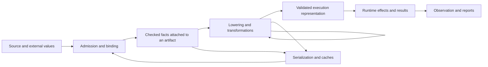

# Chelis soundness obligations and enforcement

This account connects the guarantees Chelis owes to the places that establish,
preserve, consume, and validate them. Its purpose is to explain why a failure that
has never been reported is already prohibited, and whether the system actually
enforces that prohibition.

The source snapshot is `38ab515f5e0d070d8d31ecfc9d114bbbb7b91ce0`, inspected on
2026-09-09. This is an investigative account, not new language authority, a release
verdict, or a claim that every obligation is satisfied. The detailed chapters
distinguish inspected mechanisms and test sources from executed evidence. An
unresolved entry is part of the account, not permission for the implementation to
violate its controlling contract.

## Reading the account

| Part | Question it answers |
|---|---|
| This overview | What guarantees are we accounting for, and what makes an enforcement argument complete? |
| [Additional correctness relationships](#additional-correctness-relationships-and-contract-decisions) | Which relationships need fuller treatment, and which stronger guarantees still require a contract decision? |
| [Language and static semantics](soundness/language.md) | Do syntax, binding, abstraction, typing, effects, and linearity establish their promised facts? |
| [Values, transformations, runtime, and backends](soundness/runtime.md) | Do operations, graph changes, storage, scheduling, and foreign execution preserve those facts and the program's behavior? |
| [Integration, identity, and assurance](soundness/integration.md) | Do entry points, caches, packages, workers, proofs, reports, and toolchain selection preserve the same contract? |
| [Authority and subject inventory](soundness/inventory.md) | Which specification definitions and subjects were reconciled, and what can that reconciliation establish? |

The detailed chapters are written against the same source snapshot. They are
separate views of one system: a shape witness can have a static obligation, an
execution obligation, and a wire-admission obligation without becoming three
independent semantic authorities.

## Principal conclusions at this snapshot

Chelis has enough explicit contracts to prohibit many undiscovered failures
already. What it does not have is one demonstrated, end-to-end argument that all
accepted paths uphold them. The account exposes several independent reasons:

| Conclusion | Concrete basis | Consequence for the enforcement argument |
|---|---|---|
| Strong structural boundaries exist, but establish particular facts. | [Runtime metadata, capacity, and ownership](soundness/runtime.md#3-dynamic-shapes-capacity-identity-and-access-safety): checked counts/bytes, conservative exact capacity equality, verified emission payloads, single-use reuse tokens, provenance/write guards. | Preserve and extend these boundaries. Their existence does not prove source claim equality, correct numerical algorithms, or safety of arbitrary foreign pointers. |
| Semantic acceptance is not one uniform product. | [Entry partition](soundness/integration.md#1-entry-and-success-product-partition): the public API's `check` requests type analysis; CLI checking adds effects and linearity; Deep LSP currently performs parse/stamp admission. | Every success claim must name its actual pass set. Sharing an API or calling a result “checked” does not establish full-check parity. |
| Correctly tagged computation can implement the wrong algorithm. | [Numeric algorithm limits](soundness/runtime.md#24-concrete-algorithm-limits-behind-typed-carriers): prescribed trees versus sequential folds, own-width values versus f64 images, exact random construction versus narrowed bounds/different mixing. | Registration and carrier guards need semantic algorithm validation. A plausible final dtype or agreement between shared implementations is insufficient. |
| Supported admission routes do not automatically close alternate construction routes. | [Language provenance limits](soundness/language.md#8-consequential-unresolved-findings-and-contract-limits) and [cache/worker identity](soundness/integration.md#4-package-cache-worker-and-build-identity): public serde/raw constructors, linker guard installation, independently constructible manifests. Supported cache paths do recheck effects/linearity and relower; they do not rerun every original judgment. | Name the trusted producer/caller boundary, or structurally require the missing validation. An honest trust assumption is different from making invalid states unconstructible. |
| Faithful reporting requires both correct content and correct transport. | [Report limits](soundness/integration.md#6-diagnostics-machine-reports-and-failure-delivery): the required `typed_ast` member is absent; preparation/effect/unsupported paths have different projections. | A common typed serializer can faithfully serialize an incomplete report. Measurements, fields, locations, failure timing, and consumers each retain obligations. |
| Successful validation of a selected set does not prove that the set was complete. | [Proof and test assurance](soundness/integration.md#7-proof-test-execution-and-the-assurance-boundary): proof collection can represent a depth limit as no contained producer; test selection, execution receipts, ignored/manual work and configuration interactions are separate domains. | Incomplete discovery must remain distinguishable from “nothing to check.” Prove the selection and the executed outcomes independently. |
| Some active statements do not yet form a coherent single contract. | [Language conflicts](soundness/language.md#8-consequential-unresolved-findings-and-contract-limits) and [runtime conflicts](soundness/runtime.md#81-conflicting-active-statements): flat versus curried arrows, opacity versus default exports, zero-divisor trap kind, implicit summation in composed AD, and target-wide rejection versus Host routing. | Resolve the owning normative text. Neither the implementation nor this account can silently select a new rule and call the inconsistency closed. |

These are source-derived conclusions, not newly executed reproductions or issue
severity decisions. The detailed chapters also name the mechanisms that already
check particular obligations, their positive/negative test sources, and their
remaining domains. Absence of a discovered discrepancy in a row is not a verdict
that its algorithm is correct.

## Scope and authority

The scope is the language and its toolchain, including the evaluator, C/HIP/Metal
paths, compiler API, Python/FFI, Reef, Tide/editor interfaces, and proof and test
reports. A release may select a smaller supported subset; that selection does not
erase obligations on other declared surfaces. A target cell can be explicitly
unsupported, conditionally supported, implemented, or unverified. Those are
different dispositions.

The [canonical reference](../../spec/design/chelis_canonical_reference.md) owns
project boundaries. The numbered chapters own their language and public-interface
subjects at this snapshot. OpenSpec capture has not transferred that authority.
Normative registries incorporated by an atom contribute its enumerable identities;
design plans and issue labels cannot substitute for its semantics. Roadmap and
design content is classified by what it decides: an existing implementation
contract, a current semantic rule needing its proper normative home, or a future
commitment. None is silently promoted to a shipped capability, and missing
implementation never turns an already binding semantic rule into future work.

The account complements the existing
[pipeline inventory](compiler_pipeline_inventory.md),
[quality architecture](../agent_quality_architecture.md), and
[spec-provenance design](../../spec/design/spec_provenance.md). It does not create a
second provenance engine, activate proposed governance, or change repository gates.
Conflicting authorities and missing decisions are findings to resolve at their
owning tier; repeating a chosen interpretation here would not resolve them.

### Scope horizon

The [roadmap](../../spec/12-roadmap.md) mixes project commitments, historical
status, and public-interface statements. Its status banners are not executable
evidence. The horizon below prevents future scope from vanishing while keeping it
separate from the implementation inspected here.

| Horizon | Obligations it introduces or extends | Disposition in this account |
|---|---|---|
| Current interactive and agent-editing interfaces | Stable document identity, parse/edit validation, whole-module checks, complete cascades, truthful rejection and output. | Included in the integration chapter; a roadmap statement that an edit is checked does not establish which analyses actually run. |
| Broader effects and capability refusal | Current effect propagation and declared upper bounds through imports and higher-order calls remain binding; a refusal feature additionally owes complete refusal before the prohibited operation. | Only the expanded Network/Filesystem taxonomy, audit manifests and refusal policy are future work here. Missing implementation does not defer the existing effect contract. The planned signature-based preflight is explicitly **not a runtime sandbox**. |
| Artifact signing and registry services | Publisher identity, authenticity, revocation and artifact binding under an explicit threat model. | Demand-driven future boundary; a digest alone establishes neither an authorized publisher nor hostile-input isolation. |
| Broader differentiable programming | Control-flow, ADT, effectful, implicit, and higher-order transformation relations and differentiability judgments. | Current numbered semantics and implementations are included; the larger D-track commitment is not credited as current enforcement. |
| Hydronnx and other external model import | Faithful format/operator interpretation, weight/layout/dtype conversion, provenance, typed calls, and supported-subset rejection. | External shell boundary, not an audit of the Hydronnx repository. Dynamic ONNX control flow is outside the roadmap's initial subset, not automatically supported by a generic importer claim. |
| Kerrent and later backends | New syntax and IR admission, tile/address/thread domains, kernel launch/ownership/synchronization, target semantics, and optional AD. | Future inventory extension. User-authored kernel lowering and whole-DAG lowering to Triton are different transformation boundaries. |

Adding one of these surfaces does not necessarily add a new top-level soundness
family. It does add concrete domains, transitions, consumers, observations, and
external assumptions that the existing family's argument must cover.

## What soundness means here

The central obligation is conditional and specific: when a surface accepts an
input or reports a guarantee, the promised fact must hold for the exact artifact,
inputs, environment, and assumptions to which that claim refers. Execution must
follow the allowed language behavior, including values, effects, failures, and
observations. A transform such as `grad` has its own semantic relation; unlike an
optimization, it is not required to return the original program's value.

This separates four questions that can fail independently:

1. **Contract adequacy:** are the rules coherent, and do they imply the intended
   guarantee? Correctly implementing an inadequate rule does not strengthen it.
2. **Implementation fidelity:** does each enforcing algorithm implement the rule?
3. **Coverage and composition:** does every relevant route establish and preserve
   the required facts, including alternate construction and re-entry routes?
4. **Evidence adequacy:** does the recorded validation establish the claimed
   property over the claimed domain and source snapshot?

Type soundness is one part of this account. It does not alone establish numerical
correctness, correct differentiation, faithful reporting, or correct compilation.
Likewise, a valid rejection is not a wrong answer. Rejecting a program the product
promises to support is a support/completeness defect, while fabricating a result
for an unsupported program violates the failure contract. A specified trap is a
valid behavior. A leak, deadlock, or performance regression needs its own resource
or progress obligation; it is not automatically the same defect as use-after-free.

Allowed variation must remain explicit. For example,
[04-NUM-12](../../spec/04-type-system.md#9-numeric-value-semantics) permits a specific
integer-accumulation trap-versus-exact difference where different lane orders are
authored. It does not authorize wrong values, arbitrary tolerance, or deviation
from an operation that independently mandates one exact reduction tree.
[Concurrency](../../spec/07-concurrency.md) permits different schedulers for `par`
while requiring the specified observable agreement. A blanket requirement that
every lane always produces identical execution is stronger than these contracts.

### What a comprehensive claim can mean

For an admitted program `P`, input `I`, and declared environment `E`, the basic
execution obligation can be written schematically as
`observe(execute(P, I, E)) belongs to allowed(P, I, E)`. The observation includes
the effects, failures, and other events the contract distinguishes. It must not
silently omit the very behavior under investigation, such as output before a
trap or writes to caller-owned storage.

This single-execution relation does not express every guarantee. Determinism
compares executions with the same declared inputs. Noninterference compares
executions that differ in protected inputs. A distributional randomness promise
concerns a family of outcomes, not merely one plausible sample. Such relational
guarantees need their own observation model and assumptions whenever Chelis claims
them. Rejection completeness, progress, and resource bounds also remain explicit
obligations rather than consequences of producing no wrong terminating value.

The distinction is practical: a finite set of rules can characterize an infinite
set of invalid executions. Proving those rules preserved over a defined transition
system can eliminate a class without enumerating every failing program. It still
does not establish that the model captures every external dependency or intended
guarantee. [CompCert's semantic-preservation account](https://compcert.org/man/manual001.html)
illustrates composition over compiler passes and names the boundaries outside its
central theorem; [trace-relating compiler correctness](https://arxiv.org/abs/1907.05320)
explains why source and target observations and external assumptions must be made
explicit. This investigation supplies no comparable machine-checked theorem for
Chelis.

## The obligation families

The names below organize the investigation. They are not a replacement atom
namespace, and their number is not a completeness theorem.

| Family | Obligation | Ways it can fail |
|---|---|---|
| Contract and scope | Each admitted construct and interaction has a coherent meaning and an explicit support disposition. | Silence, contradictory rules, an invalid inference from a permitted strategy to a mandatory one, or unsupported behavior presented as implemented. |
| Source and binding | Parsing, expansion, linking, resugaring, and edits preserve the specified bindings and meaning. | Capture, name collision, lost scope, wrong source identity, or a rewrite changing the program. |
| Static judgment | A successful analysis establishes exactly the types, constraints, effects, or ownership facts its interface promises. | Unvisited input, lost generic constraints, mismatched entry-pass sets, a forged checked artifact, or diagnostic-free error types. |
| Abstraction and invariants | Nominal identity, module visibility, opaque representation, and invariant admission survive every applicable construction and observation. | Forged module provenance, hidden constructor access, invalid decode, or a proof assumption mistaken for a runtime guarantee. |
| Values and operations | Each operation implements its declared domain, dtype, width, rounding, trap, ordering, and adjoint rules. | Numeric collapse, incorrect domain edges, wrong reductions, wrong derivatives, or an unauthorized backend substitution. |
| Shape and capacity | Computed extents, independently declared claims, storage capacities, strides, and index domains stay related by valid evidence. | A claim proves itself, a witness is dropped, overflow is hidden, or access precedes a required check. |
| Transformation | Every rewrite satisfies its own semantic relation and preserves the preconditions of subsequent passes. | Lost dependencies, invalid rewrite side conditions, incorrect AD/vmap composition, or stale analysis after mutation. |
| Control, effects, and failure | Execution respects selected branches, effect multiplicity/order, handlers, traps, and preceding observations. | Evaluating an untaken arm, duplicating randomness, suppressing a trap, losing prior output, or treating a missing case as zero. |
| Storage and ownership | Live values have valid representation, spatial bounds, ownership, aliasing, initialization, and lifetime relationships. | Misaligned or out-of-bounds access, uninitialized reads, double release, dangling views, or mutation of a borrowed input. |
| Scheduling and state | Initialization, parallel scheduling, and state transitions preserve the specified observations and dependencies. | Races, premature consumption, wrong initialization order, incidental container order, or unsynchronized foreign execution. |
| Boundary admission | A boundary preserves the relevant contract or re-establishes it before admitting a usable value. | Decoder bypasses, mismatched ABI/schema, independently replaceable descriptors, or foreign ownership assumptions with no validation. |
| Identity and reuse | A cached artifact, dependency, proof, or compiled binary is used only in the context for which it is valid. | Incomplete keys, stale environments, identity collisions, incompatible runtime selection, or facts reused after their assumptions change. |
| Observation and diagnostics | Values, roots, source locations, effects, errors, and command status faithfully describe the actual operation. | Lossy formatting, dropped roots, fabricated spans, empty error reports, or contradictory success fields. |
| Proof and assurance | A proof/test verdict applies to every obligation and execution it claims, with assumptions and unresolved outcomes preserved. | Obligation omission, vacuity, solver-model mismatch, unknown reported as proved, unexecuted tests, or shared wrong implementations agreeing. |
| Tool transactions | Editing, migration, install, and package operations obey their stated identity and atomicity contracts. | Partial writes reported as success, rollback failure, wrong version selection, or verification of different bytes from those published. |
| Support, progress, and resources | Explicit capability, termination, cancellation, memory, and latency promises are met within their declared domains. | A promised case cannot execute, cancellation corrupts state, required cleanup is unreachable, or a resource bound is violated. |
| Security boundary | Any claimed isolation, capability, or confidentiality property holds against its stated adversary and observations. | Conflating effect annotations with a sandbox, trusting hostile foreign code without an assumption, or omitting relevant side channels. |

Security and resource rows do not invent general sandboxing, constant-time,
termination, or bounded-space promises for Chelis. They require a disposition for
each actual promise and make the absence of a broader promise visible. A small
language core does not make its runtime, codecs, toolchain, and observation
boundaries disappear.

## Additional correctness relationships and contract decisions

A literature comparison on 2026-09-10 identified relationships that the broad
families accommodate but the original account does not develop sufficiently.
A category that could contain a failure is not yet an explanation of why that
failure is forbidden. The additions below distinguish missing treatment of an
existing obligation from a stronger guarantee that Chelis has not established as
part of its contract. They supplement the same source snapshot; they are not new
language authority, implementation findings, or execution evidence.

Correctness is the umbrella for these questions. Soundness remains appropriate
for a judgment that entails its promised semantic property, including type,
effect, and proof judgments. It should not erase the distinctions between those
claims, semantic preservation, support completeness, quantitative accuracy, and
recovery behavior. These relationships overlap the existing families rather
than constituting a disjoint or exhaustive new taxonomy.

### From-scratch consistency

For the same final logical inputs and declared environment, incremental or
cached computation should agree with an appropriate fresh computation under the
specified observation relation. The comparison varies internal history, not
just an input value: valid-to-invalid-to-valid edits, dependency deletion and
restoration, cache loading, and cancelled inference can all precede the final
check. [Self-adjusting computation](https://arxiv.org/abs/1106.0478) formalizes
agreement with functional evaluation despite mutation and reuse.

**Existing coverage and disposition:** the
[identity account](soundness/integration.md#4-package-cache-worker-and-build-identity)
already covers cache keys, admission, and layered/monolithic parity; the
[static account](soundness/language.md#5-static-type-binding-and-abstraction-obligations)
covers unfinished inference-group cleanup. [04-FIT-1](../../spec/04-type-system.md#62-partial-type-inference)
already requires cached/layered fitness reports to be byte-identical to equivalent
monolithic checks. The underdeveloped obligation is agreement across histories.
It needs an explicit observation set and a sequence-based oracle comparing
acceptance, diagnostics, inferred products, and other promised outputs after
each history. Exact byte equality for fitness does not impose reproducible
binaries or byte equality on every editor response.

### Component composition and semantic interoperability

Whole-program compilation correctness does not by itself establish correctness
when independently processed components are linked or invoked by foreign code.
The claim must identify permitted contexts and show that component guarantees
hold under their interactions. [The Next 700 Compiler Correctness Theorems](https://dbp.io/pubs/2019/ccc.pdf)
distinguishes compiler-correctness claims by their linking assumptions.

**Existing coverage and disposition:** the
[package/context account](soundness/integration.md#4-package-cache-worker-and-build-identity)
and [callable boundaries](soundness/integration.md#5-callable-entry-and-foreign-execution-obligations)
cover individual seams, but need a connecting composition argument. Imported
polymorphic declarations must retain their restrictions, effects, and
initialization meaning. A cooperating C/Python caller must respect ownership
across repeated invocations, including retained earlier results. This does not
assert that Reef caching is native separate compilation or that arbitrary
artifact combinations are supported.

ABI and value conversion are only part of the interface. A foreign helper
implementing a pure operation may use private mutation, but its observable
behavior must remain compatible with permitted sharing, elimination, and
scheduling. [Semantic interoperability](https://arxiv.org/abs/2202.13158)
and [semantic encapsulation](https://dbp.io/pubs/2023/lt.pdf) explain why foreign
state and control behavior also matter. The missing account should name those
assumptions and their validation or trusted boundary; it should not silently
promise isolation from arbitrary hostile native code.

### Elaboration coherence

When multiple typing or elaboration derivations are admissible for the same
source judgment, their resulting programs must have the same specified meaning,
or the language must select which derivation determines that meaning. Two
well-typed lowerings can disagree computationally. This is the technical
coherence question developed in
[Logical Relations for Coherence of Effect Subtyping](https://arxiv.org/abs/1710.09469).

**Existing coverage and disposition:** the
[Surf/Deep laws](soundness/language.md#3-surf-grammar-and-semantic-desugaring)
cover round-trips, while the static account covers inference and deferred
decisions. Neither is a general derivation-coherence argument. Deferred
inference, elaboration, and specialization are candidate boundaries to examine;
no ambiguity in them was reproduced here. The comparison fixes the source
judgment, including intended types and dtypes. It does not require different
explicit casts or semantically significant annotations to agree. Where the
contract prescribes a unique elaboration, fidelity to that choice is the
obligation instead of an invented alternative-derivation guarantee.

### Representation independence and replacement

Representation independence asks whether permitted clients can distinguish two
implementations of an abstract interface when a relation between their private
representations is preserved by public operations. It compares implementations
and clients, not merely two values for well-formedness.
[State-Dependent Representation Independence](https://home.ttic.edu/~amal/papers/sdri.pdf)
develops this relationship for abstract data types.

**Existing coverage and disposition:** the
[abstraction account](soundness/language.md#5-static-type-binding-and-abstraction-obligations)
covers nominal identity, hidden constructors, and invariant admission, but does
not state a general replacement relation. A useful question is whether changing
an opaque type's private layout, then rebuilding clients against each version,
can affect an observation the interface intends to hide. Equality,
serialization, and other representation-sensitive observations must be
explicitly included or excluded. Existing access restrictions do not alone
authorize unrestricted representation independence, binary compatibility, or
reuse of stale cached artifacts. The intended abstraction guarantee needs that
authority decision before an enforcement or replacement oracle can be claimed.

### Concurrent-operation histories

Individually correct operations can participate in an incorrect history.
Linearizability requires operations to admit a legal sequential explanation
respecting real-time precedence; serializability concerns the ordering of
transactions, potentially spanning several operations or objects. They are
different criteria, not interchangeable names for race freedom.
[Herlihy and Wing](https://www.cs.cmu.edu/~wing/publications/HerlihyWing90.pdf)
define and compare these conditions.

**Existing coverage and disposition:** the
[entry account](soundness/integration.md#1-entry-and-success-product-partition)
includes document updates and analysis, while the identity account explicitly
limits coherent filesystem snapshot claims. An older analysis completing after
a newer edit must not be consumed as if it described the newer document. This
example motivates a versioned publication/history contract; it is not a
reproduced LSP defect. The report needs the allowed orderings and snapshot model
for each relevant surface, with adverse interleavings as proposed controls.
Universal linearizability, multi-file transactions, or language-level shared
mutable concurrency must not be inferred from the existence of asynchronous
tooling.

### Handled failure, crash recovery, durability, and retry

These are separate questions:

- **Handled failure:** which invariants or pre-state must be restored before an
  error is returned?
- **Crash recovery:** after interruption and restart, which states may recovery
  produce, including another crash during recovery?
- **Durability:** which acknowledged successful changes must survive the declared
  crash model?
- **Uncertain completion and retry:** if a response is lost or a caller times out,
  may repeating the request duplicate an effect?

[FSCQ's crash logic](https://pdos.csail.mit.edu/6.828/2018/readings/fscq-sosp15.pdf)
separates ordinary postconditions from crash and recovery conditions. An atomic
replacement during normal execution does not establish a crash-atomic multi-file
transaction. Likewise, idempotence means repeated requests have the same intended
effect as one request, not exactly one physical execution or identical responses.
[RFC 9110 section 9.2.2](https://www.rfc-editor.org/rfc/rfc9110.html#section-9.2.2)

**Existing coverage and disposition:** the
[migration account](soundness/language.md#3-surf-grammar-and-semantic-desugaring)
already identifies binding replacement/rollback rules and uninspected failure
injection. The [foreign-execution account](soundness/integration.md#5-callable-entry-and-foreign-execution-obligations)
covers cancellation and partial-result rejection. Those requirements remain
binding; they do not establish rollback of prior effects, power-loss recovery,
durable acknowledgment, or exactly-once HTTP/MCP evaluation. Install, migration,
publication, and effectful evaluation need separate dispositions. The authoring
APIs described in the integration chapter are pure request/result edits, not
remote filesystem transactions. Proposed controls interrupt the actual stateful
operations at their publication and cancellation boundaries, then inspect the
allowed state or retry outcome under a specified failure model.

### Numerical accuracy, stability, and error composition

Faithful execution of a floating-point algorithm is different from accuracy
against a chosen mathematical function. Forward error measures answer error;
backward error asks whether the answer is exact for nearby input. Conditioning
describes the problem's sensitivity, while stability concerns the algorithm.
The domain, error measure, and permitted perturbations belong to the claim.
[Higham's numerical-stability account](https://nhigham.com/2020/08/04/what-is-numerical-stability/)

**Existing coverage and disposition:** the
[numeric account](soundness/runtime.md#2-numeric-representation-and-operation-semantics)
is detailed about widths, finalization, finite computation graphs, and lane
agreement. The prescribed `normal_cdf` graph can be implemented faithfully
without that fact establishing a mathematical CDF approximation bound. Its
standard-contract corpus tolerance is not such a bound. Mathematical accuracy
and stability become obligations where a library or property promises them;
neither a function name nor a tagged carrier creates the promise.

Local allowances also need quantitative composition when an end-to-end error
bound is claimed: sensitivity, rounding, branches, and iteration can amplify
errors. [Sound Approximation of Programs with Elementary Functions](https://malyzajko.github.io/papers/cav2019b.pdf)
uses local approximation budgets to meet whole-program bounds. Such an argument
would complement, not authorize deviation from, Chelis's existing exact graph
and per-operation semantics. No numerical-error analysis was executed here.

### Distributional and joint-sampling correctness

Reproducibility asks whether the prescribed stream is reproduced. Distributional
correctness asks what output law follows under a declared seed or random-input
model; joint-sampling correctness also asks how outputs depend on each other.
Marginal laws, independence, reproducibility, and cryptographic security are
different properties. [Random123](https://www.thesalmons.org/john/random123/papers/random123sc11.pdf)
examines stream construction, repeatability, and statistical quality separately.

**Existing coverage and disposition:** this overview already mentions
distributional promises, but the
[random-operation account](soundness/runtime.md#22-complete-primitive-family-account)
mostly develops deterministic stream and graph fidelity. A fuller account needs
the probability model, output law, joint dependence, and any approximation metric
where claimed. For example, the existing `trunc_normal` rule clips a normal
result; conditional truncated-normal sampling is a different rule, not an
interchangeable implementation. A fixed seed produces a fixed execution, and
finite floating-point outputs do not implicitly promise ideal independent
continuous samples. Statistical tests supply scoped evidence, not a proof of an
unstated distributional contract.

### Estimator correctness and calibrated statistical claims

Correct differentiation of each sampled execution does not generally establish
`E[G(theta)] = d E[F(theta)] / d theta`. Interchanging differentiation and
expectation requires conditions; parameter-dependent sampling probabilities can
require additional terms. [ADEV](https://arxiv.org/abs/2212.06386) establishes a
separate correctness relation for differentiation of expected values.

**Existing coverage and disposition:** the
[AD account](soundness/runtime.md#41-differentiation-is-its-own-semantic-relation)
covers operation adjoints and saved randomness, but not a general expected-loss
gradient guarantee. Dropout and other stochastic operations make the distinction
relevant. Existing pathwise semantics is not wrong merely because it does not
promise an unbiased estimator. Bias, consistency, or expectation-gradient
requirements need their own authority, sampling assumptions, and mathematical
argument; agreement with pathwise finite differences cannot substitute for one.

Similarly, the [assurance account](soundness/integration.md#7-proof-test-execution-and-the-assurance-boundary)
distinguishes samples from proofs but does not develop confidence calibration.
If a result claims a confidence level, its interval or error probability must
have the stated coverage under the actual dependence, selection, and stopping
procedure. [Confidence-sequence research](https://arxiv.org/abs/1810.08240)
addresses guarantees that hold across stopping times. A report labelled only
empirical does not thereby promise confidence coverage, and no such new Chelis
guarantee is adopted here.

### Contract realizability and specification non-vacuity

Contract adequacy includes more than the absence of contradictory sentences.
Realizability asks whether an implementation can satisfy the contracts under the
admitted environment and information available to it. Non-vacuity asks whether
assumptions and requirements leave the guarantee meaningfully applicable.
[Assume-guarantee realizability](https://loonwerks.com/publications/katis2016formalise.html)
and [inherent specification vacuity](https://smlab.cs.tau.ac.il/syntech/vacuity/index.html)
study these distinct questions.

**Existing coverage and disposition:** the account already records authority
conflicts and [proof-goal non-vacuity](soundness/integration.md#7-proof-test-execution-and-the-assurance-boundary).
It should also distinguish joint implementability and specification-level
vacuity from correct implementation of individual checks. A guarantee whose
antecedent cannot hold gives no protection for an actual execution. A contract
that permits every desired behavior to be rejected may fail support adequacy
even if its acceptance implication is sound. These are questions for the
controlling contracts and their assumptions; the cited methods do not establish
that Chelis's contracts have been formalized or checked this way.

### Recording and enforcing these relationships

Each applicable relationship needs a disposition: an existing requirement with
identified enforcement and evidence; an existing requirement with an incomplete
enforcement account; an unresolved contract decision; or an explicitly
unpromised guarantee. This section does not complete the implementation tracing
or supply an oracle for every relationship. Its proposed comparisons and controls
are directions for that work, not completed validation.

The obligation record must say what is quantified over or compared: executions,
derivations, permitted clients, histories, crash/recovery sequences, mathematical
functions, or probability distributions. It must identify the observation or
error relation, admissible environments, and assumptions, then connect that
statement to establishment, preservation, consumption, and evidence. Some
relations require an algorithmic or mathematical argument rather than another
typed carrier. Naming a relationship without those connections leaves the
enforcement question open.

Ordinary memory safety, AD semantics, support completeness, liveness, resource
bounds, and security already have explicit places in this account. Adding their
names again supplies no coverage. Stronger adversarial compilation, native
sandboxing, constant-time execution, or universal termination are not missing
current guarantees merely because the literature can define them.

## An obligation record

A useful record contains the following information together:

| Field | Required content |
|---|---|
| Claim and authority | Exact rule or identified authority gap/conflict; distinguish a definition, safety property, equivalence, support requirement, and resource guarantee. |
| Domain | Inputs, constructs, operations, dtypes, targets, configurations, and entry points to which the claim applies; include rejection and conditional-support rules. |
| Relation and observations | What is quantified over or compared: executions, derivations, contexts, histories, recovery sequences, functions, or distributions; name the allowed behavior, equivalence, refinement, error, or probability relation. |
| Assumptions | Permitted callers and environments, failure and recovery model, scheduling/fairness conditions, or mathematical and sampling assumptions where relevant; distinguish validated preconditions from trusted assumptions. |
| Establishment | The check or derivation that first establishes the fact; its preconditions and the identity of the artifact it validates. |
| Carrier | The value or representation that keeps the fact attached to that artifact; explain what the type itself proves and what it does not. |
| Preservation | Every transformation, copy, import, serialization, mutation, cache entry, and reuse route that must preserve or re-establish it. |
| Consumption | The operations that rely on it and the boundary that prevents consumption without valid evidence. |
| Failure | The required rejection/trap and its timing, effects, diagnostics, and observation behavior. |
| Evidence | Inspected source, positive and negative test identities, actual invocation, execution receipt, mutations, or proof, with exact scope and assumptions. |
| Residual | A missing decision, conflicting rule, algorithm gap, bypass risk, missing route census, unexecuted evidence, or external assumption. |

An issue can attach a witness to this record. Its parentage or closed state cannot
establish the record's completeness.

## How enforcement can cover undiscovered failures

For a fixed domain of artifacts and transitions, the structural argument has four
parts: every initial artifact is admitted correctly; every permitted transition
preserves the needed invariant or explicitly invalidates and re-establishes it;
every consumer requires the invariant; and every boundary outside that model has
an explicit validated contract or trusted assumption. Composition then follows
the same identities and preconditions across the transitions.

This is an obligation diagram, not a claim that the implementation has exactly
these modules or that every route already obeys it. Re-entry may use a narrower
admission check than source parsing, but it must establish the facts its consumer
requires. Host execution, device execution, proof generation, and editor analysis
each select different paths and claims through the diagram.

A private field blocks one class of construction. It does not prove a constructor's
arithmetic, a derived deserializer, all mutation methods, or unsafe foreign calls.
Exhaustive enum matching proves a disposition for enum variants, not necessarily
all nested expressions, dtype combinations, or semantic parameters. A passing
comparison proves agreement under its comparator; it does not make the comparator
or either implementation correct. These limits are part of the enforcement claim.

## Deriving the coverage domain

The domain is derived from both contracts and implementation surfaces. Starting
only from tests misses untested obligations; starting only from atoms misses
unauthored decisions; starting only from code misses promised but absent features.

| Independent view | What must be reconciled |
|---|---|
| Specification subjects | All numbered chapters, incorporated registries, unnumbered rules, and relevant public-interface contracts; distinguish architecture and roadmap from semantic authority. |
| Language representation | Grammar productions, tags and roles, types, effects, literal/carrier variants, binding and declaration forms, and their recursively nested uses. |
| Semantic operations | Primitive and derived identities, signatures, dtype domains, adjoints, accumulator rules, and parameter-dependent cases. |
| Construction and transition graph | Public/internal producers, checking entries, graph builders and rebuilds, mutation methods, decoders, caches, context composition, and foreign adoption. |
| Consumers and observations | Evaluator, each backend, runtime, exports, CLI/editor/API consumers, diagnostics, proof/test verdicts, and persisted artifacts. |
| Configuration and environment | Supported features, targets, profiles, hardware, libraries, compiler/linker flags, schema/ABI versions, and explicit external assumptions. |
| Validation execution | Selected test identities, actual invocation and outcomes, platform conditions, negative controls, mutants, skipped/ignored rows, and receipt freshness. |

The applicable domain resembles `obligation × construct × route × configuration`,
with relationships that exclude meaningless combinations. It must not be replaced
by a blind Cartesian product or a fixed count. Every exclusion needs a reason
from the contract or a verified reachability boundary. A new operation, public
entry, carrier, rewrite, or supported target revisits its connected obligations.

The [inventory](soundness/inventory.md) reconciles named definition membership and
chapter subjects. That is useful coverage evidence, but not semantic completeness:
one paragraph can contain several obligations, and no regex can demonstrate that
the language has no unauthored interaction.

## Worked chain: a declared extent must agree with execution

The requirement comes from [spec/04 section 4.7](../../spec/04-type-system.md#47-runtime-shape-semantics),
[04-SHAPE-1](../../spec/04-type-system.md#474-runtime-shape-expression-execution),
[04-NUM-11](../../spec/04-type-system.md#9-numeric-value-semantics), and the owning
movement/descriptor rules in [spec/05](../../spec/05-risc-primitives.md).
The [runtime-extents design](../../spec/design/runtime_extents.md) explains the
chosen implementation, but does not replace those authorities.

An independently declared extent is a claim about the observed value. Copying
that claim into the computed shape and comparing the copy to the original proves
nothing about the value. A valid positive control therefore uses independent
sources that agree; a negative control changes an observed extent while retaining
the declaration.

Static types do not always prove that equality: the language deliberately admits
wildcards, specified list-join uncertainty, and return-only dimension exceptions.
The first link must preserve the independent claims and unresolved obligations,
not pretend the checker has already proved every runtime shape. A specified
dynamic mismatch must be guarded and reported faithfully.

| Link | Required relationship | Inspected mechanism or evidence source | What remains distinct |
|---|---|---|---|
| Check and instantiate | Preserve the declaration and its caller-specific witnesses. | `prepare_parameter_witnesses`, `preserve_literal_result`, and `retain_invocation_witnesses` in [lower.rs](../../crates/chelis-ir/src/lower.rs). | These functions handle particular literal-result paths; their presence does not establish every named/generic/root case. |
| Carry and rebuild | Retain required witnesses and remap dependencies through transformations. | `RiscOp::ExtentWitness`, `DagNode::shape_deps`, and `Dag::preserve_shape_deps` in [dag.rs](../../crates/chelis-ir/src/dag.rs). | A helper's existence does not establish that every rebuild invokes an equivalent preservation rule. |
| Execute | Compare the independent observation at the specified point and propagate failure. | `ExtentWitness` cases in [eval.rs](../../crates/chelis-ir/src/eval.rs) and [C emit.rs](../../crates/chelis-backend-c/src/emit.rs). | Exact guard order, every target, and output delivery require their own execution evidence. |
| Cross the wire | Preserve requirement values, operand identity, ordering, and graph validity, or reject. | `NonnegativeExtent` in [schema/numbers.rs](../../crates/chelis-compiler-api/src/schema/numbers.rs); [schema/dag_domains.rs](../../crates/chelis-compiler-api/src/schema/dag_domains.rs). | Nonnegativity proves neither equality with a caller's tensor nor allocation capacity. |
| Allocate and access | Derive checked count/byte/index domains from valid metadata before unsafe use. | Private `ShapeMetadata`, `ElementCount`, `ByteCount`, and `IterationSpace` in [metadata.rs](../../crates/chelis-runtime/src/metadata.rs); `checked_tensor_metadata` and `validate_data_contract` in [runtime lib.rs](../../crates/chelis-runtime/src/lib.rs). | Metadata arithmetic, source-claim equality, backing-storage liveness, and pointer validity are different obligations. |
| Validate the chain | Exercise agreement and mismatch through the real entries, transformations, transports, and outputs. | [runtime_extent_oracle.py](../../scripts/runtime_extent_oracle.py), [literal transport tests](../../crates/chelis-ir/tests/runtime_extent_literal_transport.rs), and [checked metadata tests](../../crates/chelis-runtime/tests/checked_metadata.rs). | Test source and oracle registration do not establish execution or all-route closure. |

For this chain, the account must explain all of the following before calling
enforcement complete: literal and named claims; nested and independent calls;
unused but potentially trapping computations; aliasing and rebinding; each graph
rewrite; wire/cache restoration; each admitted execution target; zero, negative,
large, and overflowing domains; and effects before and after failure. The exact
operation contract decides which combinations apply.

Potential controls follow from the obligation before any bug is found: delete a
required witness, swap its input, replace a claim with an inferred value, move its
guard after allocation, omit a wire field, change the dtype, or suppress preceding
output. The validating mechanism should reject the invalid artifact or the
semantic oracle should detect the changed behavior. These are proposed controls,
not execution receipts from this investigation.

## Evidence and completion of this account

Evidence is recorded by what it establishes, not as a single green flag:

- **Authority inspected:** the cited text states the requirement; conflicts and
  scope qualifications remain visible.
- **Mechanism inspected:** source identifies enforcement and its visible limits.
- **Test source inspected:** concrete positive/negative assertions exist; no run is
  implied.
- **Execution recorded:** named cases ran on the identified source/configuration
  with observed outcomes; skipped cases and empty selection are not passes.
- **Adversarial execution recorded:** a real invalid construction or behavior
  mutation was detected, with the tested mechanism and route identified.
- **Formal argument/proof:** the model, theorem, trusted assumptions, and link to
  the executed implementation are explicit.

Reconciled membership means that every discovered contract subject and surface
has a disposition. That alone cannot establish that discovery covered the
intended scope: an omitted discovery boundary could make a tidy inventory
misleading. Scope adequacy therefore needs the separate reasoned argument from
the independent language, implementation, boundary and observation views, their
cross-chapter assumptions, explicit exclusions, and review. Every enforcement
claim must remain bounded by its evidence. This permits a comprehensive account
of an incompletely enforced system without claiming a completeness theorem,
proving Chelis sound, or declaring a release ready.

There are four distinct completeness claims:

| Claim | What would justify it |
|---|---|
| Inventory membership is reconciled. | The discovered authority/subject/surface members each have an explicit disposition and unexpected members fail reconciliation. |
| The obligation model covers the intended scope. | The independently derived language and boundary views, their interactions, and explicit exclusions have been challenged; contract gaps remain visible. |
| Enforcement closes the permitted routes. | Every admitted construction and transition preserves the invariant or revalidates it, and every relying consumer is covered under the stated assumptions. |
| Behavior is validated to the claimed strength. | Actual execution or proof evidence covers the stated cases/model and configurations, including invalid cases and failure of the enforcement itself. |

The first two claims organize this account. They do not imply the latter two.
Detailed chapters state the remaining route and evidence gaps instead of assigning
an aggregate soundness percentage. A future fix changes the relevant obligation
record and its evidence; closing one historical witness cannot retire the broader
obligation.

### Investigation receipt and scope judgment

The investigation used three independent subject reads (language, runtime, and
integration), followed by a full synthesis read and cross-chapter reviews. Those
reviews corrected substantive boundaries: cached reconstruction does perform
effect/linearity revalidation and relowering (since chelis#2558 the effect and
linearity reruns remain only on cache payloads without a lowering to compare,
the dependency cache among them); existing effect obligations are not
future work; callable and evaluator admission domains differ; and the Metal
target/Host-routing rules are not silently reconcilable. They also separated
inventory reconciliation from the reasoned adequacy of the discovery scope.
These were source/document reviews, **not repository red-team rounds**.

The original reviews judged the families broad enough to organize the identified
Chelis obligations across the declared language/toolchain boundary. The
[2026-09-10 literature comparison](#additional-correctness-relationships-and-contract-decisions)
subsequently identified relationships needing explicit treatment, despite fitting
those families. Broad family coverage therefore does not establish completeness
of the obligation statements or their enforcement arguments. The additions
distinguish existing requirements from unresolved stronger guarantees; neither
the original inventory nor the literature comparison is a theorem that no
intended requirement or interaction could have been omitted.

Read-only/document diagnostics run on 2026-09-09 against the source snapshot:

| Check | Observed result | Limit |
|---|---|---|
| Existing `discover_atoms` parser | 168 unique definition IDs. | Enumerates the defined atom grammar; not all semantic prose. |
| `scripts/generate_rejection_registries.py --check` | `REJECTION REGISTRIES: BYTE AGREEMENT PASS`. | Existing generated registry byte agreement, not semantic enforcement. |
| Locked/offline Cargo metadata | 33 workspace members; declared features extracted. | No compilation, feature matrix execution, or external dependency verification. |
| Local account reconciliation | 168/168 atom rows, 107/107 level-two chapter locations, 33/33 workspace members; every atom explicitly locatable in its assigned chapter; no missing/extra members. | Checks membership and routing, not truth of the surrounding interpretation. |
| Local document links and whitespace | All five documents present; local file/heading/reference targets resolve; no trailing whitespace. | A working citation is not proof of its claim. |
| Live tracking-hub crosswalk | 35/35 hubs, no missing or extra IDs. | Label/navigation reconciliation only, not full-thread status or closure audit. |

The local task checker is `target/soundness-map/check_account.py` in the research
worktree; it is scratch validation, not a new repository gate. The discovery
commands are in the inventory. No compiler behavior test, numerical comparison,
sanitizer, hardware workload, acceptance oracle, or hosted CI run was executed
for this account. Its evidence grades do not borrow historical green results
from the launch ledger.

The intentionally unestablished claims are equally concrete: a whole-workspace
call-graph/constructor proof; individual correctness of every standard-library
algorithm; complete feature/platform interaction coverage; correctness of
external shell implementations, installed editors and arbitrary embedding
applications; and a proof of external compilers, solvers, native libraries,
operating systems, drivers or hardware. Their connecting obligations and trust
assumptions remain in the account rather than being treated as verified.

## Using the account without creating another issue catalogue

For a new failure, the useful question is which existing obligation was violated
and which establishment, preservation, consumption or evidence boundary allowed
it. A new issue is a witness and a work owner; it is not the source of the rule.
If no coherent rule governs the behavior, the missing contract decision is the
first finding.

For a new feature or repair, this account offers a review method, not an
additional mandatory gate:

1. Identify its normative domain and exact observable behavior, including rejection
   and allowed variation. Mark a real contract decision instead of inferring one
   from the current implementation.
2. Trace how each relied-on fact is established, attached to the same artifact,
   preserved or invalidated through changes, and required by consumers. Include
   alternate constructors, caches, contexts, bindings and target configurations.
3. Choose enforcement at the right level: a representation for impossible states,
   a checked transition for admission/preservation, an algorithm for numerical or
   semantic fidelity, and an oracle or proof for the claimed evidence. These are
   complementary; none is a universal substitute for the others.
4. Derive positive and negative controls from the rule, including controls that
   break the enforcement or omit a required case. Use independent discovery and
   real execution receipts where the claim requires them.
5. Update the relevant obligation and its existing authoritative registry/oracle,
   with exact scope and remaining assumptions. Do not create a parallel semantic
   authority or let a new baseline silently bless an unclassified surface.

The durable outcome is a connected argument: **this behavior is forbidden by
this rule; this boundary establishes the required fact; these transitions retain
it; these consumers cannot legitimately proceed without it; and this evidence
supports exactly that claim.** Where a link is absent, the account says so.
