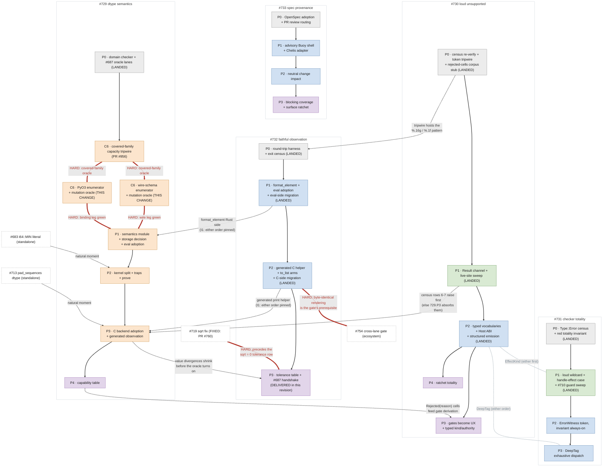

# Numeric Remediation Roadmap: sequencing, ownership, and the ledgers

**Status:** Living coordination document for the plan set that came out of
the 2026-07 numeric audit. This doc owns four things nothing else owns:
the **global sequencing** across the five plans, the **release boundaries**
(where the version cuts fall, sliced to keep each downstream-shell bump
digestible and never temporary), the **unclaimed-issue ledger** (every filed
issue that no plan's kill table claims, with its assigned home), and the
**deferred-evidence ledger** (claims still resting on inspection, each with
its verification task). It contains NO contracts
of its own - contracts live in the five plans; when this doc and a plan
disagree, the plan wins and this doc has a bug.

The plan set: [`dtype_semantics.md`](dtype_semantics.md) ([#729]), [`loud_unsupported.md`](loud_unsupported.md) ([#730]),
[`checker_totality.md`](checker_totality.md) ([#731]), [`faithful_observation.md`](faithful_observation.md) ([#732]),
[`spec_provenance.md`](spec_provenance.md) ([#733]), plus the [`capability_table.md`](capability_table.md) schema (rides
[#729] Phase 4) and the audit record under `docs/investigations/`.

## The class map

| meta (the class) | method (design spec) | tracker |
|---|---|---|
| [#727] no dtype's semantics enforced at any single point ([#695] = its integer instance) | [`dtype_semantics.md`](dtype_semantics.md) - per-dtype finalizer behind private constructors, int/float kernel split, one storage decision, generated backend dispatch | [#729] |
| [#703] unsupported cases substitute values instead of failing | [`loud_unsupported.md`](loud_unsupported.md) - Result-typed failure channels, the census sweep, dependency-bottom closed identities, fail-closed HostType/ABI states, structured emission, gates demoted to UX, and (2026-07-30) §C7 ratchet totality: derived-universe guards including Python/C consumers, typed/live exclusion authority with review-owned relevance, the typed kind/authority channel, and a non-shippable mutation-based panic-surfacing oracle | [#730] |
| [#709] unrecognized constructs silently exempt from checking (+[#710]'s silent half) | [`checker_totality.md`](checker_totality.md) - loud wildcard + handle-effect case, ErrorWitness token (silent Type::Error unconstructible), totality invariant, DeepTag exhaustiveness | [#731] |
| [#728] the observation channel is not dtype-faithful | [`faithful_observation.md`](faithful_observation.md) - one Rust formatter, generated C print helper, round-trip invariant, tolerance table; landable before [#729]; unblocks [#687] | [#732] |
| spec silence + stale claims ([#694]; the unauthored cells) | [`spec_provenance.md`](spec_provenance.md) - OpenSpec plans changes after Phase 0 activation, while a pinned Buoy shell and one-way Chelis adapter provide repository-independent authority, freshness, coverage, and impact enforcement; design/fixtures may proceed now, advisory execution waits for Buoy's final oracle, and blocking waits for the adapter and Chelis configuration oracles | [#733] |

This map is scoped to the 2026-07 numeric audit's plan set and stays that way.
The `meta (the class)` column names a META issue per row; that pairing is
historical and is NOT the pattern for a new class - `AGENTS.md` section Issue
Tracking Conventions owns the one-tracker-per-class rule now.

**Sibling classes, tracked on their own issues, not here.** Listed only so a
reader of the five plans above does not go looking inside them for work they
structurally cannot deliver. Each row is a limit of one of the five and the
issue that took it:

| what one of the five cannot deliver | handled at |
|---|---|
| [#731] makes a silent `Type::Error` unconstructible by gating its constructor. The same move is unavailable for `Type::Unit`, which is an ordinary type with no constructor to gate (its own section C3 says so), and `DeepTag` exhaustiveness forces *a* disposition, not a correct one. Neither reaches the `Atom` / list-head domain | [#908] ([#885], [#887] Tier 2). [#887] Tier 1 stays with [#731], which does deliver *diagnosed* |
| [#730] makes callable rejections loud and explicitly non-goals making them WORK ("that is [#729]'s or an op-owner's work"), so a C-host function-value ABI has no owner anywhere in the five | [#909] ([#866], [#867], [#879]). [#868] keeps its [#730] parent - span threading IS section C2's contract |
| [#729] seals numeric construction behind private Rust constructors. It has no reach into the C runtime, where `chelis_tensor.data` is a `pub` untyped `*mut u8`; Phases 0-4 never touch it | [#893] ([#899], [#889]). [#892]'s bool storage still rides [#729]'s v0.19 cut |
| [#730] section C2 declares the diagnostic span normative and [#731] owns checker diagnostics, but neither has a phase that threads one: `Unsupported::with_span` and `CheckError::with_span_id` both have zero call sites | [#883] ([#868], [#886] keep their [#730] parent) |
| [05-OBS-1..5] were each conditioned on a stored numeric value reaching an exit, so root existence, naming, order, and the `build` artifact obligation were outside [#732]. [05-OBS-6] now authors the always-labelled manifest-order envelope and the unavailable-root [05-UNS-1] requirement; complete manifested observation/build consumption is still not delivered by the formatter plan | [#912] ([#820], [#862]), with the post-[#1003] integration/acceptance residue tracked at [#1023]. [#775]'s shape half remains [05-OBS-4] under [#732] |
| no numeric plan touches `chelis reef conform`'s audit surface, which the four bump waves below keep regenerating gaps in | [#788] ([#814], [#825], [#845]) |

None carries a wave assignment; they are not sequenced against the waves.

Supporting: [`capability_table.md`](capability_table.md) (schema; rides [#729] Phase 4),
[`docs/agent_quality_architecture.md`](../../docs/agent_quality_architecture.md) ([#740]), the seeded atoms
(spec/04 §9-§10, spec/05 §7-§8), and [PR #696](https://github.com/Chelis-Lang/chelis/pull/696) (the acceptance surface).

## Global sequencing

The plans are deliberately independently landable - every pairwise
interlock is pinned in both landing orders (each doc's §I1). The
*recommended* order optimizes for detectors-before-fixes and for
small-wins-early:

**Wave 0 - all five Phase 0s, in any order, immediately.** STATUS
2026-07-20: four of five LANDED 2026-07-17 - the domain-validity
invariant + [#687] oracle lanes ([#729] P0, PR #758; named receipt
`.venv/bin/python scripts/dtype_phase0_oracle.py`, continuously inherited by
the Phase 1/2 chain), the substitution
census verification + token tripwire ([#730] P0, PR #746), the
`Type::Error` census + red totality invariant ([#731] P0, PR #757 -
`issue_731_totality_invariant.rs`), the round-trip harness + exit
census ([#732] P0, PR #752). The one outstanding Wave 0 item is OpenSpec
activation + PR review routing + `spec/**` signoff ([#733] P0). The design PR
does not activate that workflow; Phase 0's configuration, instructions, and
oracle do. Phase 0 makes no Buoy assurance claim and keeps OpenSpec and
provider metadata outside canonical product authority. The two ordering
handshakes
(the `%.16g`/`%.1f` grep pattern landing in [#730] P0's tripwire; [#729]
P0 and [#732] P0 sharing lane drivers) were honored and are now
historical.

**Wave 1 - the small loud fixes.** STATUS 2026-07-20: COMPLETE. [#731]
Phase 1 (the checker holes: loud wildcard, the handle-effect case, the
seed-literal diagnostic, the MalformedForm sweep) merged as PR #793;
[#730] Phase 1 (the Unsupported Result channel with the speculative-
sub-lowering laundering path closed structurally, every live census row
converted) merged as PR #791. [#732] Phase 1 (the formatter + eval
adoption + the eval-side migration, a Wave 2 item entered early per the
standing exception) merged as PR #792 the same day. All three were
fresh-context red-teamed (QUALIFIED PASS x3) with every confirmed
finding folded in before merge; the red teams' discoveries are filed as
[#794]/[#795]/[#796].

**Wave 2 - the independently-landable value work.** [#732] Phase 1
landed with Wave 1 (above); [#732] Phase 2 also LANDED (PR #863) and
delivered the generated C side, fixing [#716]/[#723] outright and giving the
refactor its byte-exact instrument; its one authoritative completion
oracle is
`.venv/bin/python scripts/faithful_observation_phase2_oracle.py`,
accepted at exit 0 with final line `PHASE 2 ORACLE: PASS` - it carries
the known-red ledger that keeps every annexed [#729]-family cell
re-executed rather than silently skipped, and fails when one goes
green, so the upstream repair's landing forces the un-ignore in the
same change set. That protocol has now retired the [#864] cell: current
execution showed its root metadata was already F64, while the static
`to_tensor` lowering shortcut discarded the checked dtype of each literal
leaf before widening it. The construction fix carries NO typed leaf: static
extraction keeps [#856]'s exact `RawScalar` and finalizes only FLOAT leaves,
at the width read from each leaf's own type metadata. Routing every leaf
through an f64 value field - the shape an earlier draft proposed - would
have reintroduced the above-2^53 integer loss that exact lane prevents.
The original assertion covers enclosing-tensor and scalar-widening shapes,
and the repaired row is locked into the oracle's unconditional must-run
inventory after leaving the known-red ledger. The same protocol retired the
[#684] row ([#1078]) and annexed [#1110], whose compiled-lane half now leaves
the ledger through [#729] Phase 3: host lowering finalizes a suffixed literal
at its checker-stamped width before an enclosing widening cast. This is a
narrow [#717]/[#729]-family value repair and does not claim the atomic
per-dtype-storage Phase 1 migration. It ran in parallel with [#731] Phases 2-3 (the
witness token + DeepTag). [#730] Phase 2 is COMPLETE AND
ACCEPTED (PR [#799], merged 2026-07-24): closed vocabularies, staged
HostType/ABI separation, and structured emission, with the authoritative
oracle green (`PHASE 2 ORACLE: PASS`) and the plan-set's fresh-context
adversarial review run and dispositioned
(`docs/investigations/pr799_returned_function_values_redteam.md`). Its
initial source-lint approach was explicitly re-planned after execution
showed incomplete and false-positive behavior; the lint was extracted to
PR [#815] (since closed unmerged) and is not a Wave 2 dependency. [#733] Phase 1's Buoy shell-side design
and fixture preparation may ride alongside: OpenSpec still plans new
normative text and atom IDs remain stable. The executable advisory pilot
waits for the selected Buoy revision's standalone `devenv test` final
oracle and the shell-adapter prerequisites; once admitted, it reports
malformed authorities and stale registrations without blocking existing
Chelis commands or coupling `buoy-core` back to Chelis.
[#732] Phase 2 additionally gates the ECOSYSTEM's compiled-lane
validation: no shell runs a compiled binary today, and [#754]'s
cross-lane agreement gate (the mechanism [#738]'s conform row points
at) is hard-gated on byte-identical rendering.

**Wave 3 - the semantics refactor.** [#729] Phases 1-3 in order (the
module + storage decision; the kernel split + prove; backend adoption),
validated by everything Waves 0-2 built. Phases 1 and 2 landed through PRs
#1049 and #1054; PR #1065 is the bounded Phase 3 integer-`abs` seed, and this
revision delivers the remaining Phase 3 C value work. The required Linux
Integration job runs the nested
`.venv/bin/python scripts/dtype_phase3_oracle.py`, making the Phase 0-3
acceptance chain continuous. Entry gate: the [#729] §C6
covered-family capacity census/tripwire (PR #956) lands BEFORE Phase 1
entry. This change completes the two typed hard edges: the wire-schema and
PyO3 binding commands in [#729] §C6 are implemented with reviewed baselines
and red mutations (`capacity_census_wire` and `capacity_census_bindings`,
respectively). Phase 1 re-derives its §C3 layer set from that completed
census. These remain explicit thick-red DAG edges below, not editable
coverage metadata (PR #950 red teams P2-4 and re-P1). The exact PR #956 follow-up
`6ddf1a72d6dea6770a330d5c2ef3b8fa7d023c43` is part of that entry gate:
conditional macro definitions taint their connected local-include
component, bare and pointer-sized integer C callables classify
conservatively as `numeric-op`, and only the three byte-frozen
pre-ratchet plumbing declarations named in [#729] §C6 are exempt. The
2026-07-31 round-4 fold-in completes that entry gate: an arithmetic
spelling the census does not recognize is a build failure rather than an
unflagged row, and adding a `chelis_types::Prim` variant stops the
tripwire compiling until the new dtype is classified.

**Wave 4 - the permanent guards.** [#729] Phase 4 delivers the capability
table per [`capability_table.md`](capability_table.md); [#733]
Phase 3 (the first blocking provenance ratchet) ships with it only after
the advisory Buoy pilot and change-impact phases are green; [#732] Phase 3
(the tolerance table + the [#687] handshake) is delivered by the revision
carrying this text and closes the internal oracle with
`.venv/bin/python scripts/faithful_observation_phase3_oracle.py`; [#754]
remains its external shell consumer.
[#730] Phase 3 (gates become UX; amended 2026-07-30 to also deliver the
typed diagnostic-kind and rejection-authority work) keeps Wave 4 as its
recommended slot but is NOT gated on the capability table or the Buoy
pilot - its own deliverable stands on "let the emitter's channel speak"
whether or not the table has landed. This doc previously read as if it
were gated; per this doc's own rule the plan won and the sentence was
corrected 2026-07-30. As of 2026-08-01 the focused typed-authority and sealed
diagnostic-kind slices are implemented; the gate inventory/contract and full
Phase 3 oracle remain. [#730] Phase 4 (ratchet totality, added
2026-07-30: product-source-manifest ratchets with non-Cargo language
adapters, typed/live exclusion references, the non-product
mutation-based panic contract, and the change-gated + nightly
structural-authority jobs) is
guard work that may land any time after [#730] Phase 2 and carries no
wave assignment. Its user-visible halves are decided by [05-UNS-5..6]
(spec/05 §7, authored 2026-07-30); the plan implements them. Citation
presence may land before blocking freshness and coverage, but every
selected capability row ultimately binds one current controlling atom
revision.

Standing exception: any Wave may be entered early for a cell that becomes
urgent - the interlock sections make that safe; this ordering is advice,
not law.

## The dependency DAG

The sequencing above as a graph. NOTE: GitHub renders this as one tall
cascade - a degraded but still correct view. For the intended
side-by-side column layout, open it in VS Code's markdown preview.
Solid arrows are the within-plan phase chains - the only hard sequencing.
Dashed arrows are soft interlocks with a recommended direction; the
alternative order is pinned in the owning docs' §I1 sections. Dotted
arrowless links are shared-component coordination with no inherent
order: [#730] Phase 2 delivers `EffectKind` and [#731] Phase 1 consumes
it (string-match + loud else if it lands first). `DeepTag` exhaustiveness is
owned entirely by [#731] Phase 3; it has no dependency on the extracted
[#730] source lint. The thick red edges are the hard dependencies: inside the
plan set, [#719]'s fix precedes [#732] Phase 3's `sqrt = 0` tolerance
row (SATISFIED 2026-07-17: PR #760 merged, [#719] closed - the row may
be authored when Phase 3 arrives); downstream of the set, [#754]'s
ecosystem gate is hard-gated on [#732] Phase 2's byte-identical
rendering. [#729] Phase 1 is separately hard-gated on PR #956's
covered-family tripwire and both typed-leg oracles. Not drawn
(for legibility): OpenSpec remains [#733]'s planning workflow while a
pinned Buoy shell and one-way Chelis adapter provide enforcement.
The graph is acyclic. Node colors
are the waves above: grey = Wave 0, green = Wave 1, blue = Wave 2, orange =
Wave 3, purple = Wave 4 (so [#733]'s advisory Buoy pilot, blue, may ride Wave
2); white boxes with dashed borders are standalone fixes outside the wave
structure. LANDED marks the four Phase 0s merged 2026-07-17, the three
Phase 1s merged 2026-07-20 (PRs #793/#792/#791), and [#730] Phase 2
merged and accepted 2026-07-24 (PR [#799]). [#730] Phase 4 (ratchet
totality, added 2026-07-30) hangs off its Phase 2 and interleaves
freely with its Phase 3.

## Release slicing: where the version cuts fall

Sequencing above is about *phase dependencies*; this section is about *release
boundaries* - a different axis. The plans are independently landable, so a
version cut can fall wherever a coherent set of phases is green; the thing that
decides *where* is **downstream-shell migration cost**, not the internal wave
numbers.

The governing rule: **every release moves a shell-facing surface to its FINAL
state, or does not touch it at all.** The failure mode to avoid is a surface
that lands in an intermediate state a shell must adapt to and then re-adapt to
- silent to loud to supported in three separate bumps, `seed(42)` to `42i64`
to some third form, render-shape A to B to C. A one-time break shells absorb
once is cheap; a break they make and later unmake is the expensive kind. Like
the sequencing above, this ordering is advice, not law; a cut may move if a
cell becomes urgent.

Current baseline (2026-08-04): **v0.18.3 is shipped**. Two further patch cuts
landed on the v0.18 line after v0.18.1, and the second of them is a real
migration cut - do not read the patch-level version as "mechanical".

**v0.18.2** (2026-08-03) was additive: the `chelis-std` CSV/JSON serializers
(chelis#928), the eval-lane JSON/CSV builtin families (chelis#890, chelis#903),
`chelis eval --timeout` (chelis#914, chelis#930), Nix packages and a Devenv
shell (chelis#907), [#729] Phase 2's typed integer semantics, and exact
trapping integer `abs` in C (chelis#1065). Its one source-visible delta went
the wrong way and shipped as a **recorded divergence**: eval's `shape` returned
int32 against [05-DIM-2]'s int64 SHALL, released with an explicit
do-not-migrate-onto note rather than a migration instruction (chelis#1120).

**v0.18.3** (2026-08-04) is both a **source migration** and an **exact-output
migration**, per its own release record:

- [05-DIM-1]/[05-DIM-2] extent dtypes shipped (chelis#1130, for chelis#1112):
  `shape()` now returns int64 and the movement bounds (`shrink`/`pad`/`stride`/
  `expand` extents) take int64. Bare int32 extent call sites become check
  errors - extents get `i64` suffixes, while axis parameters stay int32. This
  also retires 0.18.2's chelis#1120 divergence, so a shell that skipped 0.18.2
  migrates once rather than twice.
- Compiled-lane `round` now half-ties to even (chelis#1142): an exact-output
  change on half-tie values that brings C into conformance with
  roundTiesToEven. Eval was already conforming.
- `cast_trunc` exists as [05-OP-6] and is a new reserved word (chelis#1144):
  identifiers named `cast_trunc` no longer parse, and shells blocked by
  [04-NUM-14]'s fractional-cast trap migrate each site onto it.

The v0.17 and v0.18 rows
below are therefore historical records, while v0.19 and v0.20 remain planned
cuts. v0.18.1 already shipped [05-OBS-6]'s `name = ` prefix in both lanes. It
did not deliver the manifested root set/order, unavailable-root behavior, or
artifact boundary; that remaining root-topology migration rides the next
source-migration cut (v0.19). A cut's migration note is the **breaking-change
summary**, not the full release contents: most of what a cut carries is ordinary
work, and only the deltas called out below force a downstream change.

### What actually forces a downstream change

| class | shell-visible change | cost |
|---|---|---|
| A - syntax migration | `with seed(42)` -> `42i64` ([#731] P1) | one-time, final |
| B - loud rejection of silently-wrong code | [#730]/[#731]/[#729] loud paths, [#730] P2 host-type | shells fix a real bug; permanent |
| C - wire / binding break | [#729] §C3 per-dtype storage (schema + Python payload) | one-time; **must be atomic** (§C3 forbids partial adoption) |
| D1 - payload rendering change | [#732] canonical element/container grammar, then [#729] own-width eval completion | exactly two authorized steps: the shipped formatter grammar and one final eval value-width correction in v0.19; frozen afterward |
| D2a - root label prefix | [05-OBS-6] `name = value` | SHIPPED once in v0.18.1; frozen; does not reopen D1 |
| D2b - manifested root topology | [#912]/[#1023] complete root set/order, dotted expansion, unavailable-root diagnostics, and artifact routing | one coordinated post-v0.18.1 migration in both lanes; may not alter D1 or D2a |
| E - reject-now-support-later | [#730] loud reject -> [#729] kernel lands | the add-then-remove-workaround trap |

The class-E anti-churn tool is the capability *decision* itself: whether a cell
is supported or a stable, cited `Unimplemented { issue: #N }` rejection is a
behavior fact, and **every such decision ships in v0.19 with the dtype break** -
never deferred to the v0.20 table. A shell then writes the `chelis#N` narrowing
citation once, against 0.19, and removes it only when the kernel actually lands
- a real event, not a slicing artifact. The v0.20 table only *mechanizes*
decisions 0.19 already made, so it is behavior-preserving by construction.

### The cuts

| cut | carries | shell impact | notes |
|---|---|---|---|
| **v0.17.0 - loud checking + canonical eval rendering** (SHIPPED) | [#730] P1 + [#731] P1 + [#732] P1, and everything else merged since 0.16.1 | **source migration** (wave 1) | breaking deltas only: loud rejections (incl. the new loud compiled-lane `test_*` assert, [#796] - the old inert-`0` stub is gone, so anything leaning on it fails heavily in E2E), `with seed(n)` -> `42i64` ([#731] P1 - the Shoals / Whale / hello-chelis HEAD canaries fail on unsuffixed seeds), and dtype-faithful eval rendering. Seed form frozen ([#735] changes only meaning); eval payload render frozen (C matches it at 0.18) |
| **v0.18.0 - checker totality, DeepTag, host-type/ABI boundary, compiled rendering** (SHIPPED) | [#731] P2 (PR #800) + [#731] P3 (DeepTag) + [#730] P2 (PR #799 vocab + host-type/ABI state) + [#732] P2 (compiled render) | **mechanical** for shells | no wire break ([#730] P2 preserves the `CHELIS_*` ids); the added loudness lands on already-broken code, so no *expected* source migration. Completes byte-identical payload rendering. The release-hygiene requirement is that the tarball ships `chelis_runtime_dtype.h`, which public `chelis_runtime.h` includes |
| **v0.18.1 - always-labelled root prefix** (SHIPPED) | [05-OBS-6]'s `name = value` prefix from #994, with the stale repo expectations synchronized in #1011 | **exact-output migration** | shipped the prefix once without changing payload digits or value shape; it did not prove manifest completeness, dotted expansion/order, unavailable-root diagnostics, or artifact routing |
| **v0.19.0 - grounded dtype storage/wire break + every behavior-changing capability decision + manifested root completion** | [#729] P1-P3 landed atomic per §C3, **plus every capability decision that changes behavior** - integer-overflow traps and each supported-vs-`Unimplemented` disposition (int `mean` [#724], bool arithmetic [#726], the [#715] rows, the HIP/Metal/C reject cells) - plus the prelude JSON/CSV integer-capacity decision (a `JInt`-shaped variant and integer accessors) for any prelude numeric channel this cut admits - invariant 7 HOLDS such channels out of every earlier release unless they land integer-capable from the start ([#729] §C3's amended census) - any published-ABI signature change deferred here by anti-churn invariant 7, and [#912]/[#1023]'s complete manifested root boundary | **source migration** (wave 2) | the one wire break and one root-topology expectation migration are coordinated here; class E resolves here, not at the 0.20 table. Bindings adapt to the per-dtype payload once; capability behavior and root topology are final; the v0.18.1 prefix does not move again |
| **v0.20.0 - behavior-preserving permanent guards** | [#729] P4 (the capability *table*, mechanizing 0.19's decisions) + [#730] P3 (gates -> UX) + [#732] P3 (tolerance / cross-lane oracle) + [#733] P3 (first blocking provenance ratchet) | **mechanical** for shells | guaranteed behavior-preserving: no decision, rejection, or rendered byte changes here - 0.19 shipped them all. [#733] P0 lands independently before this cut, while its P1-P2 advisory integration is a prerequisite rather than v0.20 release payload. `tests_blocked/` probes are re-adjudicated against the now-standing table |

Net downstream shape: the original four-cut `conform` model assumed one bump,
probe re-run, and inventory refresh per minor cut. Actual history inserted two
additional shipped contract patches: **v0.18.1** changed exact root-output
expectations by adding the [05-OBS-6] prefix, and **v0.18.3** changed both
source (int64 extents) and exact output (compiled `round` half-ties). The
source-visible waves are now shipped **v0.17** (seed suffix + fixing
loud-rejected code), shipped **v0.18.1** (root label prefix), shipped
**v0.18.3** (int64 extents, `round` half-ties, the `cast_trunc` reserved word),
and planned **v0.19** (wire/capability behavior
+ manifested root topology). v0.20 remains mechanical. No later wave may undo
or restyle an earlier one - and a patch-level version number is not by itself
evidence that a cut is mechanical.

Cadence for non-contract work: an **internal-only** change (a refactor, a
checker-internal fix, doc-only work) normally **rides the next planned cut**
rather than getting its own release; only an **urgent downstream bug fix** - a
shell blocked on a real defect - justifies an out-of-band patch release. PR
#819's `compile_and_load` metadata fix did not ship in 0.18; it now rides the
next compatible planned cut unless a current shell blocker justifies a separate
patch.

### The anti-churn invariants

1. **Atomic wire break.** [#729] §C3 is all-layers-or-nothing; never split the
   storage decision across releases or binding consumers adapt N times.
2. **Payload grammar once; own-width completion once; root-prefix once;
   root-topology once.** [#732] froze the numeric grammar and
   container/scalar shape for eval at P1 and C at P2. [#729] Phase 1 is the
   one permitted follow-up to eval payload digits: per-dtype storage completes
   shortest-round-trip rendering at the declared width (for example f32
   `1.2247449159622192` becomes `1.2247449`). No later [#729] phase may change
   those digits or shapes. [05-OBS-6] later authored a separate envelope around those frozen
   payloads; its `name = ` prefix shipped once in both lanes at v0.18.1. The
   remaining manifested root set/order, unavailable-root, and artifact cut
   rides v0.19 once. Neither later step may reopen [#732]'s formatter decisions
   or restyle the shipped prefix.
3. **Frozen seed form.** [#731] P1's `i64` suffix is the final syntax; [#735]
   authors only meaning. Safe to ship to shells at 0.17.
4. **Decisions before tables.** Every behavior-changing capability decision
   (supported vs a stable, cited `Unimplemented { issue }`) ships in v0.19; the
   v0.20 table only mechanizes them. Never leave a bare loud error in one cut
   that a later cut reclassifies - a shell cites once, against 0.19.
5. **v0.20 is mechanically behavior-preserving.** If any change in the guards
   cut would alter a result, a rejection, or a rendered byte, it belongs in 0.19
   instead. That guarantee is what lets shells treat the 0.20 bump as pin-only.
6. **Ship what the public headers include.** A release whose public runtime
   header gains an `#include` (0.18's `chelis_runtime_dtype.h`) must add that
   file to every tarball; a published-artifact smoke that compiles a trivial C
   unit against the shipped `chelis_runtime.h` catches the omission before it
   reaches a downstream build.
7. **Published-ABI signatures freeze between cuts.** From now until the 0.19
   storage break, a change to an exported signature in the published runtime
   headers is 0.19 payload by default - it rides the one budgeted ABI break,
   never a cut promised "mechanical". A mechanical cut must be able to assert
   the header-signature inventory unchanged; [#729]'s §C6 capacity tripwire is
   the mechanism once it lands. Motivating instance: PR #891's
   `chelis_pad_sequences` gaining an `int pad_dtype` parameter (flagged in the
   2026-07-30 sweep, unmerged) inside the window the 0.18 note promises "no
   wire break". The same freeze governs prelude numeric channels: a PR adding
   one (the #891 `Json` shape) ships in NO release before 0.19 unless it lands
   with its final integer-capable form from the start - "if it lands before
   the break" is a fact pattern, not a hold; THIS sentence is the hold (PR
   #950 red team P2-5). The in-tree precedent is already final-from-the-start:
   `packages/chelis-std/src/io/json.ch` carries `JsonInt(int64)` beside
   `JsonFloat(f64)`.

### Per-cut conform checklist

Every minor cut gets a mechanical `conform bump` PR wave across the shells;
the 0.17 and 0.19 source-migration cuts additionally carry real source edits.
The shipped v0.18.1 patch was an extra exact-output expectation migration, and
the shipped v0.18.3 patch carried both a source migration (int64 extents) and
an exact-output one (compiled `round` half-ties); each owed the same probe and
inventory refresh, and 0.18.3 owed real source edits as well. Each wave
carries:

- a migration note as the **breaking-change summary** (the delta below), the
  `chelis#NNN` refs it closes, and the exact surface that changed - not the full
  changelog;
- a re-run of every shell's `tests_blocked/` probes (a probe flipping green =
  remove the narrowing citation for that ref);
- the multi-location pin-consistency guard and the `docs/CHELIS_SURFACE.md`
  capability-inventory refresh;
- a published-artifact smoke that compiles a trivial C unit against the shipped
  `chelis_runtime.h`, so a header the release forgot to package (0.18's
  `chelis_runtime_dtype.h`) fails the release, not the downstream build;
- at 0.19 only: the wire-schema version bump acknowledged at each Python
  consumer.

Migration-note stubs (the breaking delta per cut):

- **0.17** (source migration) - "`check`/`build` now fail loudly where they
  silently substituted (incl. compiled-lane `test_*` asserts, which no longer
  stub to an inert `0`); `with seed(n)` requires an `i64`-suffixed literal
  (`seed(42i64)`); eval output is dtype-faithful (integers print as integers).
  Known HEAD-canary casualties: Shoals, Whale, hello-chelis (unsuffixed seeds),
  plus any E2E leaning on the old assert stub."
- **0.18.0** (mechanical) - "pin bump only: more previously-silent errors are
  caught (bogus casts, non-record field access, malformed host types) but on
  already-broken code; compiled and eval output now render byte-identically; the
  runtime tarball gains `chelis_runtime_dtype.h`. The public runtime header
  also drops the unused `chelis_print_f32` export ([#732] Phase 2 - a tensor
  print with no emitter in any backend, so no compiled program could reach
  it); a shell that declared it directly loses a symbol it could never have
  usefully called."
  NOTE, against the natural instinct to bundle: [#894]'s
  `chelis_fill_bool_bits(t, uint32_t)` -> `chelis_fill_bool(t, uint8_t)` rename
  does NOT ride this cut. It is a bool STORAGE change (4-byte f32 encoding to
  one native byte), so anti-churn invariant 1 puts it in **0.19** with the rest
  of [#729]'s storage break - the int32 decode fixes go the other way, because
  completing [#730] §C6.2 is 0.18 payload. Two C-ABI deltas in one header do
  not justify merging two cuts; the storage decision is all-layers-or-nothing
  and the header is only one of its layers.
- **0.18.1** (exact-output migration, shipped) - "every emitted root now uses
  the `name = value` prefix in both lanes. Update exact stdout expectations;
  payload digits and value shape are unchanged. This does not yet promise the
  complete manifested root set/order or unavailable-root diagnostics."
- **0.18.3** (source + exact-output migration, shipped) - "`shape()` returns
  int64 and the movement bounds (`shrink`/`pad`/`stride`/`expand` extents) take
  int64 per [05-DIM-1]/[05-DIM-2]; bare int32 extent call sites are now check
  errors, so suffix extents `i64`. Axis parameters are unchanged at int32.
  Compiled `round` half-ties to even, an exact-output change on half-tie values
  only. `cast_trunc` is a new reserved word: rename any identifier using it, and
  migrate sites blocked by [04-NUM-14]'s fractional-cast trap onto it. This cut
  also retires 0.18.2's recorded int32-`shape` divergence, so do not migrate
  onto 0.18.2's shape return."
- **0.19** (source migration) - "dtype semantics are grounded: integer overflow
  traps instead of wrapping, per-dtype tensor storage (wire-format v2, Python
  payload shape changed), narrow dtypes preserved end-to-end. Eval float tensor
  elements now render shortest-round-trip at their own width, so an f32 tensor
  prints `1.2247449` where it printed `1.2247449159622192`; every op x dtype
  capability decision is now fixed (supported, or a cited stable rejection).
  Checked casts now trap instead of choosing an implicit conversion for
  fractional float-to-integer values (`cast(3.5, int32)`) and non-member bool
  values (`cast(2, bool)`); apply `floor` or `round` before the integer cast,
  and produce exactly 0 or 1 before a bool cast. Python `np.uint64` ingress now
  raises `ChelisError` instead of silently producing an f64 payload; choose an
  explicit int64 or f64 conversion.
  The v0.18.1 root prefix is unchanged; the complete manifested root set now
  appears in manifest order in both lanes. Update expectations for added or
  reordered dotted roots, and treat an unavailable owed root as a named
  diagnostic rather than a missing line or missing `main`."
- **0.20** (mechanical) - "pin bump only: the capability table, gates-as-UX,
  [#733] Phase 3 blocking provenance ratchet, and the cross-lane oracle land;
  Phase 0 landed independently and Phases 1-2 were advisory prerequisites. All
  encoding decisions already shipped in 0.19 - no behavior change."

### Historical tag gate and the 0.17 sequence

A source-migration cut separates two kinds of breakage, handled differently:

- **Repo-owned** failures gate the tag. The heavy E2E failures from the new
  loud compiled-lane `test_*` rejection ([#796]) are the repo's own tests and
  **must be green before tagging** - a cut is never tagged over a red repo E2E.
- **Shell-owned** failures do not gate the tag; they are the *expected*
  migration signal (the Shoals / Whale / hello-chelis HEAD canaries failing on
  unsuffixed seeds). Their `conform` bump fixes are **prepared before the tag**
  so shells migrate promptly once it lands.

The planned 0.17 sequence was:

1. Merge the corrected release-slicing change (this PR).
2. Once the repo-owned `test_*` E2E is green, make the short-lived 0.17 release
   commit and tag it.
3. Verify the published assets (the header smoke: every `#include`d runtime
   header is in the tarball).
4. Start the shell `conform` bump migrations (the seed-suffix fixes, prepared
   in advance).
5. Merge PR #800 (the 0.18 witness work) only afterward - it does not ride 0.17.

## The unclaimed-issue ledger

Filed issues no plan's kill table claimed, each now with an owner. Rule:
an entry leaves this ledger only by appearing in a plan's issue map, in
the capability table's seed decisions, or by being closed.

**Scope note.** This ledger covers issues in the numeric audit's families.
Issues outside them - the Python bindings cluster, the 0.17.1 parser
regression, the prove surface, the host-lane I/O proposals, the stdlib assert
gap - are carried by the `area:*` labels and their own trackers, not here.
The rows the 2026-08-04 validation pass added
(`docs/investigations/remediation_status_2026_08_04.md`) apply that scope by
PARENT rather than by subsystem: [#870] and [#872] surface on the prove
lane but are parented to [#730], so their disposition is owned here while
the rest of that surface stays with its own tracker.

**Assignment now lives in the GitHub sub-issue graph**: every issue below is
parented to the class that owns it, so "which plan claims this" is a
structural fact rather than a table entry. What this ledger still owns is
the **disposition prose** - the two-part splits, the natural moments, the
raise-or-prove caveats - which a parent link cannot carry. A row whose
disposition is fully captured by its parent may be deleted; a row carrying
a judgement may not.

| issue | what | assigned home |
|---|---|---|
| [#681] | Std.Decimal negative `result_scale` leaks an unbranded error | standalone small fix; diagnostic text should conform to [#730] §C2 when touched. No plan dependency. |
| [#683] | `i64::MIN` not writable as a literal | standalone front-end fix; natural moment is [#729] Phase 2 (the exact int lane makes the round-trip testable), but nothing blocks doing it sooner |
| [#689] | HIP int64 ops emit F32 kernels | two-part: the SILENT half dies at [#730] Phase 1 (`elem_kind` raises); the SUPPORT half is owned by capability-table B-cells `Unimplemented { issue: #689 }` until int64 kernel templates land (see [`capability_table.md`](capability_table.md) seed decisions) |
| [#690] | HIP has no integer div-by-zero guard | rides the same HIP B-cell work as [#689]; the guard is part of `Implemented` for HIP int division cells, not a separate errand, and the kernel-template guard is the whole fix. Deliberately NOT labelled a missed migration: what already holds this is a RECORDED CELL ([`capability_table.md`](capability_table.md) names the div-guard gap on the [#689] rows), not an executable mechanism, and Table-B mechanization is Phase 4 work - so until then the ownership is documentary and the row is a STRUCTURAL GAP whose mechanism is scheduled rather than standing. Future detector, once the GPU lanes join [#754]'s cross-lane gate (both it and [#737] still open; [#736] is closed): eval aborts branded on a zero divisor where HIP returns exit-0 garbage, so lane agreement re-catches a regression here without a hand-written HIP-only assertion |
| [#691] | C DAG lane emits fmaxf/fabsf for int64 | repaired in [#729] Phase 3: integer min/max/abs dispatch through exact checked integer paths; the original rows remain ordinary regressions. The [#730] rejection-authority liveness pin held the ISSUE open while emitter sites cited it as live authority; PR #1164 rehomed those citations to historical prose (`chelis-backend-c/src/emit.rs:821` and `:3271` today describe the repair rather than a live rejection), `spec/design/loud_unsupported_issue_manifest.json` no longer lists it, and [#691] CLOSED 2026-08-04 with the `rejection-authority-liveness` job green. The pin itself is unchanged and still binds every OTHER cited authority: `scripts/validate_rejection_issue_manifest.py` fails closed on a closed authority, which the issue-closing reference in PR #1151's own body demonstrated when that PR merged |
| [#693] | Metal int64 `abs` zero emission | root cause is [#699] (confirmed by emission); Metal B-cell `Unimplemented { issue: #693 }` until the MSL integer path is wired post-[#699]-fix |
| [#713] | `pad_sequences` allocates int32 output for int64 input | repaired in [#729] Phase 3 at the typed runtime allocation/copy boundary; the int64 row is in the authoritative Phase 3 oracle |
| [#734] | `to_string` on tensors/lists compiles to the literal `<value>` | [#730] census row 3; the substitution died at [#730] Phase 1 and is unwritable after Phase 2. CLOSED 2026-08-04: the compiled catch-all is now a §C2 `Unsupported`, so the placeholder is gone; the remaining support half - actually rendering tensors and lists via [#732]'s formatter in the C host lane - is tracked at the open [#1059] |
| [#751] | generated C emits uncompilable / sign-losing float constants (f64::MAX as integer literal; -0.0 as `-0`) | repaired in [#729] Phase 3 by exact-bit C literal emission; all four former `C_LANE_EXCLUDED` rows returned to the always-run corpus and the exclusion ledger is empty |
| [#754] | shell-invokable cross-lane agreement gate (owner: brittonr) | downstream consumer, not plan-set work: hard-gated on [#732] Phase 2; consumes Phase 3's tolerance artifact and [#729] Phase 4's capability table (cell skipping); GPU lanes join after [#736]/[#737]; [#738] is its consumer; the one-comparator rule is pinned in [#732]'s §C4.3. Scope boundary (2026-07): a verdict proves lane agreement for its RECORDED (target triple, C toolchain + flags incl. -ffp-contract, libm identity) only - never cross-platform determinism by itself; the platform axis compares verdicts across CI matrix entries under the same tolerance table. Platform priority (Jeff, 2026-07-20): server-side Linux x86-64 is the primary verdict platform before any wider matrix. The -ffp-contract entry in the provenance flag set now has a measured in-house exemplar: the pre-[#770]-fix `uniform_like` affine was contraction-dependent (PR #779 removed the sensitivity at the source) |
| [#763] | `chelis lane-check` - the exact-only, Nix-hermetic first slice of [#754] (owner: brittonr) | child of the [#754] row: same one-comparator rule and proof-scope boundary; for its exact-safe corpus, byte-identity holds TODAY. [#732] Phase 2 unlocked corpus expansion, and [#729] Phase 3 returned the former [#751]/[#761] curated gaps as ordinary regression rows |
| [#761] | C lane flushes f32 subnormal literals to zero at ingress (the to_tensor route; found by [#719]'s fix session) | repaired in [#729] Phase 3 by exact f32 bit emission at the C ingress; the direct and cast-mediated rows are unconditional oracle fixtures |
| [#775] | scalar top-level roots render as a rank-0 tensor in eval but a bare scalar in compiled C | SUPERSEDED 2026-07-29: the disposition below said "deliberately fixed in NEITHER lane now ... until Phase 1 decides". Phase 1 DECIDED it on 2026-07-20 and shipped it as [05-OBS-4], and eval is conformant on execution (0.17.1: `root = run()` renders `root = 0.1`, not the rank-0 wrapper). The divergence as filed no longer reproduces. What survives is the MIRROR image - the C lane's `print` exit still emits `tensor(shape=[], data=[9.0])` where [05-OBS-4] says the rank-0 wrapper is not an exit form - which is [#732] Phase 2's scope. Re-verify and close, or re-scope to the C instance. This row is one of four faces of an unauthored root contract, tracked at [#912] |
| [#780] | matmul shape checking lost through an unannotated lambda parameter - a Surf-reachable false green (found in [#773]'s red team; pre-existing on both sides of the [#773] fix) | [#731] family: a silent unresolved-var acceptance, the deferral-shaped cousin of silent `Type::Error`. The old "sequenced behind [#731] Phase 1-2" note EXPIRED UNFULFILLED - Phases 1, 2, and 3 all shipped without deciding lambda-parameter binding, so the note was holding the issue rather than routing it. Re-pointed at the named post-Phase-3 function-parameter typing channel in [`checker_totality.md`](checker_totality.md), whose oracle is this repro plus [#847]'s. STRUCTURAL GAP, not a missed migration: no landed guard holds this class, and the shape to refuse is two local patches - one per repro - that leave the binding and re-check rule undecided and the next unannotated parameter silent |
| [#783] | annotation writeback degrades an unresolved Var to a rank-0 default and clobbers a concrete annotation (a silent [#703]-class substitution; the enabler of the transient [#773]-fix conv2d ICE, hotfixed same day) | sits between [#731] (the silent-degradation discipline) and [#730] (the substitution shape). The INSTANCE is settled: the conv2d trigger is guarded at all eleven shape-computed overrides and regression-locked by `issue_778_conv2d_annotation_clobber.rs`. What is still owed is the DURABLE INVARIANT - covered-or-rejected on the type-metadata channel, never replace a concrete annotation with a degraded one silently. STRUCTURAL GAP: eleven guarded sites are an inventory, not a mechanism, and a twelfth writeback inherits nothing from them. It lands either inside [`checker_totality.md`](checker_totality.md)'s named post-Phase-3 item (the same channel decides what an unresolved parameter type may become) or as a witness-style invariant on the writeback channel in the [#731] Phase 2 shape - one home, not both |
| [#794] | `.dp`-reachable lowering-side value substitutions the PR #793 red team confirmed: `extract_f64_value`'s catch-all folds a `(par ...)` bound's FIRST child (spec/03 says last), and `extract_usize_value` silently maps a negative `.dp` int64 seed to 0 | [#730] census extension rows. The checker side is already closed (PR #793 narrowed its accept-set to `lit` and rejects negative literal seeds), so both are checker-unreachable today - the lowering fix is defense-in-depth per §C1.4 |
| [#795] | conv2d's present-but-non-literal stride/padding fall to `unwrap_or(1)`/`unwrap_or(0)` in lower.rs (the [#776] value-default shape; census row 23, discovered in [#730] Phase 1's sweep) | [#730] census row 23, and its §C1.4 raise-or-prove now CONVERTS: the present-but-non-literal stride/padding case becomes a live `Unsupported` raise as a STANDALONE change on the Phase 1 pattern, explicitly NOT gated on [#730] Phase 3 or Phase 4 - neither gates-as-UX nor ratchet totality is a prerequisite for one more row taking the conversion its own class already defines. MISSED MIGRATION: the Phase 1 sweep IS the guard, and this row was left behind it under a liveness caveat (the checker's shape rules may cover it) that raise-or-prove exists to settle either way. The tripwire baseline holds the site until the raise lands; it is a placeholder, not the disposition |
| [#796] | compiled-lane `test_*` assertion builtins: pre-[#730]-P1 binaries compiled assertions to inert `0` stubs (could never fail); now loudly rejected | RESOLVED BY DECISION 2026-08-04: the row's own second option ("an authored eval-only contract") is already authored, in `spec/05-risc-primitives.md` §3.6.1 - the `test_*` family is host-only, has no compiled-lane emission arm, and its rejection is deliberately liveness-scoped through the C host emitter's catch-all rather than the whole-program host-only gate. So the DEFECT this issue filed is dead: PR #791 removed the inert stub, and a compiled program that calls an assertion on a reachable path is rejected loudly. What survives is a FEATURE request - a compiled binary that can fail its own assertions - which §3.6.1's closing sentence already specifies (real C assertion helpers). Close [#796] citing §3.6.1 and carry the feature as its own issue: leaving it open under a class tracker makes the class read incomplete when its actual defect is fixed, which is the inverse of the honesty this plan set exists for |
| [#840] | `chelis build` reports success but emits non-compiling C for defs named after C keywords (`double`, `long`, ...) - the identifier cousin of [#751] | standalone `chelis-backend-c` emission fix at the `CIdentifier`/`EmittedExpr` chokepoint (mangle or reject loudly, never uncompilable C from exit 0); joins [#751]/[#761] in [#763]'s corpus curation; found by the PR [#799] red team (F2), likely pre-existing |
| [#847] | `grad` over a function-valued model parameter unifies independently declared rigid dim params `n` and `m` at check time (the generic Jacobian-row wrapper is rejected; the concrete-dim variant checks) | [#731] family: the function-valued-parameter typing channel, the over-unification flip side of [#780]'s silent acceptance. Same expired Phase 1-2 sequencing note and the same new home - the named post-Phase-3 function-parameter typing channel in [`checker_totality.md`](checker_totality.md), which decides binding and re-check for unannotated lambda parameters and function-valued parameters ONCE, with the two repro tests as its oracle. STRUCTURAL GAP: deciding it twice (a rigid-dim fix here, an inference fix at [#780]) is exactly how a channel ends up with two policies. The standalone-earlier option stands if this keeps blocking Nautilus.CurveFit, but then it lands as the channel decision, not as a local unification tweak |
| [#850] | a call to a `sig`-declared export with no `def` body passes `chelis check` at score 1.0 with an EMPTY error list, and `chelis build` lowers it to an undeclared C function that fails only at the native toolchain (surfaced via Std.Io.Parquet) | two-part, the [#689] shape, and each half now names its executable home. The CHECK half is [#731]'s silent-exemption class and lands as a NAMED ROW in §C4.4's fitness-honesty corpus, stating the general rule rather than the Parquet instance: a declaration with no runtime backing is a check-time rejection or a typed capability, never a special case, so a score of 1.0 with an empty error list over an unbacked `sig` fails the corpus for any such declaration. STRUCTURAL for that half - the rule is what is missing, and one `sig`-shaped patch leaves every other unbacked declaration accepted. The BUILD half is the [#703]/[#730] emission-honesty class and lands as a CELL in [#763]'s corpus beside the uncompilable-C family ([#751]/[#840]); there the guard already exists, so adding the cell plus emitter-side rejection as defense in depth is the migration |
| [#851] | match-arm pattern binders leak into top-level cycle detection: a valid program whose top-level binding name matches a pattern binder anywhere in its call graph is rejected with a false `binding cycle` (0.17.1) | standalone checker fix in the [#780]/[#783] binder/scoping channel: a checker false positive rather than totality work. The old "must not contradict what [#731] Phase 1-2 decides" caveat is now STALE - PR [#1136] decided and landed arm-pattern binder scoping (`collect_pattern_binders`, `chelis-deep/src/authoring.rs:1455`, on the Deep authoring surface), so nothing here waits on a pending decision. MISSED MIGRATION with a structural condition on the fix, and the condition is sharper than the issue suggests because the duplication ALREADY EXISTS: three copies of the pattern-binder walk are in tree today - the [#1136] one, a legacy-carrier twin at `chelis-macros/src/lib.rs:1029`, and a `Pattern`-typed one at `chelis-reef/src/lib.rs:8453`. The first two agree on all five pattern arms but NOT on exhaustiveness, which is the property this row rests on: the [#1136] copy enumerates every non-pattern tag explicitly so a new `DeepTag` is a compile-time decision there ([#731] Phase 3's pattern), while the macros copy ends in `_ => {}` and would treat a new pattern form as binder-free. That is this row's own warning already instantiated - copies of one policy where the PERMISSIVE copy is the exposure - so the divergence is concrete rather than hypothetical. The fix is therefore not "avoid making a second copy", it is: the scoping helper reaches a shared home (`chelis-types` already depends on `chelis-deep`), `collect_eager_refs` (`chelis-types/src/infer/declarations.rs:1839`) becomes a CONSUMER rather than a fourth author, and the macros twin converges onto it or is recorded as deliberately separate with a reason. A fourth hand-rolled walk re-creates [#697]/[#698] verbatim - copies of one policy where the permissive copy guards the lane that matters - which trades this false positive for a future divergence |
| [#888] | `DimExpr::normalized_key` folds concrete dimension factors with `saturating_mul`, so two different tensor sizes get the same key and C/HIP memory planning reuses a slot at the wrong capacity (VERIFIED by execution, Surf-reachable) | standalone. Kept here because it is the compiler-internal face of this plan set's own trap contract: [04-NUM-3] makes USER integer overflow trap in every lane while the compiler's size arithmetic saturates here and wraps in [#889]. That is an accident, not an exemption, and should not be read as one. [#889] rides [#893]'s runtime hardening |
| [#870] | `chelis-prove` aborts (SIGABRT, via the wait-timeout SIGCHLD self-pipe) when the environment denies `sendto`, instead of degrading | [#730] family: an abort is not a diagnosed failure. STRUCTURAL - the fix is the fail-closed-degradation pattern Phase 2 already shipped for the HostType/ABI states: an unavailable capability becomes a named, reported state that the caller can act on, never a crash. A denied `sendto` is an ENVIRONMENT fact the prover must be able to say out loud, so the deliverable is the typed degraded path plus a negative test that RUNS with the mechanism denied. Catching this one signal is the wrong shape: it repairs the sandbox that filed the issue and leaves the next denied mechanism aborting |
| [#872] | `chelis-prove`'s `type_from_deep_depth` depth-32 fuse projects to `Type::Unit`, so an opaque-type producer nested deeper than 32 drops out of the obligation set | [#730] family and a genuine [#703]-class silent substitution: the prover then reports success over a SMALLER problem than the user asked about, with nothing on the surface saying so. Two moves, both on existing protocol rather than invented for this site: a CENSUS EXTENSION ROW in [`loud_unsupported.md`](loud_unsupported.md) (the census owns which substitutions exist; one outside it is invisible to the class and to the tripwire), then the Phase 1 conversion - a raise carrying the fuse's own authority. STRUCTURAL: the census plus tripwire IS the guard here, and repairing the projection without adding the row leaves the next fuse unlisted |
| [#878] | `RiscOp::Pad { fill: f64 }` carries the fill through f64, so an int64 fill above 2^53 collapses | pointer row: the disposition already lives in [`dtype_semantics.md`](dtype_semantics.md) §C3, which names this the one remaining raw constant-carrier seam now that [#856] is closed. It rides the v0.19 storage break (§C3 forbids partial adoption) and lands before [#729] Phase 4 closes. STRUCTURAL BY CONSTRUCTION rather than by argument: the §C6 capacity census already FLAGS the seam, so the guard is standing and migrating the fill onto `ScalarValue` SHRINKS the frozen seam list instead of adding a citation to it |
| [#901] | `TensorValue`'s mixed integer/float equality arm computes `i.abs()` ad hoc for its exact-representability test and panics on `i64::MIN` (`chelis-ir/src/eval.rs:164`) | [#729] family. MISSED MIGRATION onto the sealed semantics layer: "is this integer exactly representable at that float width" is a dtype question, so it is answered in [`dtype_semantics.md`](dtype_semantics.md) §C3's sealed module (`chelis-types/src/dtype_semantics.rs`), which already holds [04-NUM-8]'s declared widths and the neighbouring exactness helpers (`as_i64_exact`, `to_i64_exact_vec`, `compare_scalars`). The predicate this site needs - is this integer exactly representable at that float width - does NOT exist there yet and is written there, not inlined here; the single-enforcement-point design is the whole point of the class. A local `unsigned_abs`/`checked_abs` swap is the wrong shape: it removes this panic and leaves hand-rolled numeric arithmetic sitting in an equality operator, which is [#727]'s class statement restated one line later |
| [#906] | eval aborts with a stack overflow on flat list literals of roughly 2-4k elements, killing the literal-baking data path | [#730] family: an abort is not a diagnosed failure. STRUCTURAL - apply the typed stack-budget pattern already shipped for the lowering recursion (a budget diagnostic that fires BEFORE the native stack runs out), whose depth-oracle harness invariant is recorded in [`checker_totality.md`](checker_totality.md)'s 2026-08-03 construction-gate note: a green test proves the diagnostic rather than accepting an abort. The work item that shipped it is WI-1 in [`verification_stack_dependency_map.md`](verification_stack_dependency_map.md), NOT a `checker_totality.md` deliverable - so what this row inherits is the pattern and the harness, not a phase slot. Extend that harness's depth-oracle coverage to the eval literal-folding site, so the recursion-abort class is covered there rather than patched there. Raising a stack size or spawning a bigger-stacked thread is wrong by construction: it moves the cliff and keeps the abort as the failure mode |
| [#937] | `emit_uniform_like` writes f32 samples through `float *data` with no dtype dispatch, so f64 `uniform_like` returns near-zero garbage in compiled C while eval is correct | pointer row, two parts, neither of them a site patch. The op x dtype disposition is a [`capability_table.md`](capability_table.md) seed row (supported, or a stable cited `Unimplemented`), shipping with the v0.19 capability decisions per anti-churn invariant 4; the supported case is typed per-dtype emission. The recurrence guard is a cross-lane parity row NOW ([#763]'s exact corpus reaches this cell) and [#729] Phase 4's GENERATED conformance suite permanently. STRUCTURAL: this defect is direct evidence for why the generated suite exists - nothing was wrong with the hand-curated matrix except that it had no cell here, and hand-curation cannot be audited for the cells it lacks |
| [#942] | `cast` rejects any tensor whose element type came from inference (`expand`, `uniform_like` results) - a `_ =>` wildcard turning an unresolved-but-legal type-state into a false rejection | [#729] family, STRUCTURAL in the repair even though the symptom is one arm wide: make the match EXHAUSTIVE over the type-state, the [#731] Phase 3 DeepTag pattern, so the next type-state added anywhere upstream is a compile error at this site instead of a fresh false rejection. Adding the missing arm beneath a surviving wildcard is the shape to refuse - it fixes the two reported producers and leaves every future one failing for the identical reason |
| [#955] | backend-c host lane cannot lower nested `Option`/`List` composites ([05-UNS-1]); separately, nothing in CI builds a std-importing program, so eval-only std code ships green | SPLIT, and the halves have different owners. The LOWERING half is a capability DECISION in the v0.19 batch: supported, or a stable cited `Unimplemented { issue: #955 }` a shell narrows against once (anti-churn invariant 4). The COVERAGE half is the more durable finding and belongs to the example/corpus lane - a corpus cell that actually BUILDS std-importing programs. Landing lowering support does not close that half: without the cell, the next host-lane std gap ships green the same way this one did |
| [#980] | UNVERIFIED report that integer overflow semantics differ by op, build profile, and lane | [#729] family, and the first task is VERIFICATION rather than repair: the filed evidence is intact but unreproduced, and a claim this shaped is settled by a repro in one sitting. A confirmed release-profile wrap is a [04-NUM-3] violation (user integer overflow traps in EVERY lane, debug and release alike), and its repair rides the v0.19 trap completion, not a hunt for wrapping arithmetic site by site. STRUCTURAL: the recurrence guard is the trap-contract oracle rows executing under the RELEASE profile, since a debug-only assertion is precisely what lets a release wrap survive a green suite |
| [#1009] | `pad_sequences` / `pad_sequences_to` have no normative spec text (surfaced by PR #891) | [#729] family, spec side. Both callables predate the semantic-registration ratchet (`AGENTS.md` Numeric Surface Discipline: a numeric op binds one verbatim `[05-OP-N]` atom in its own change set), which prevents the NEXT unregistered callable but backfills nothing. MISSED MIGRATION with that ratchet as the standing guard: author the two atoms - signature, per-dtype semantics at [04-NUM-8]'s declared widths, adjoint or non-differentiability, accumulator rule where one applies. Natural moment is [#729] Phase 4 entry, since their capability cells need governing atoms regardless, but a spec-only change lands earlier without waiting for it |
| [#1113] | axis-argument dtype enforcement is inconsistent across ops: `sum` rejects int64 axes while `cumsum`/`concat` accept int32 and int64 | [#729] family, and the interim half is MOSTLY LANDED - PR #1145 shipped the centralizing helper (`reject_non_int32_axis`, `chelis-types/src/infer/static_value.rs:518`) covering eight surfaces: `gather`, `cumsum`, `sort`, `scatter`, `scatter_replace` through `resolve_builtin_axis`, `diagonal` and `trace` through `resolve_axis_pair_member`, and `split` calling it directly, with positive and negative pairs in `crates/chelis-types/tests/issue_1113_axis_dtype_guard.rs` and the `sum` reference pin. TWO THINGS REMAIN, and the first is the interesting one. (a) `concat` does NOT route through the helper: the same PR that centralized the other eight gave `concat` its OWN inline guard (`chelis-types/src/infer/app_post.rs:1449-1470`), and its acceptance predicate is NARROWER than the helper's. The arm fires only for a non-int32 INTEGER prim, where the helper rejects every axis type that is not `Int32`/`Var`/`Error`, so an `f32` or `string` axis on a List operand skips the guard entirely and reaches `concat`'s generic `concat expects matching List inputs, got {lhs} and {rhs}` fallthrough (`:1540`) instead of a branded int32-axis rejection. The integer messages happen to coincide byte for byte - `Type`'s Display for a prim is `Prim::name()`, the same call `concat`'s arm makes - so the divergence is COVERAGE, not wording, which is the harder kind to notice. Nothing structural forced the separate arm either: `concat`'s operand is a `List`, so `resolve_builtin_axis`'s bounds check does not apply, but the bare helper would have served exactly as it does for `split` - and `split`'s own call site says so, its comment recording that its former `precision.is_integer()` pre-guard was "the same acceptance hole `concat` carried". A ninth spelling appearing in the act of centralizing the first eight is the class lesson in miniature: centralization without a tripwire does not hold, so converging `concat` should ship WITH a check that every axis-taking builtin reaches the helper - the [#1147] PP2 shape applied to this registry. (Three pre-#1145 hand-written checks also survive - `shape` at `app_post.rs:768`, `permute` at `app_shape.rs:237`, and a generic one at `app_numeric.rs:354` - which are the enforcers the helper's own doc comment names rather than new drift.) (b) The numbered-atom classification, stated by that doc comment ("chelis#1113 owns the numbered-atom classification; until it lands this keeps the acceptance closed so no axis-taking builtin silently admits an int64 axis while `sum` rejects one."). The rule it holds closed is already decided - v0.18.3 shipped int64 extents per [05-DIM-1]/[05-DIM-2] while axis parameters stay int32 - so the atom RECORDS that decision rather than making it. The durable home stays [#729] Phase 4's Table-A-derived acceptance, which DELETES the hand-listed per-op checks ([#712]'s class dies there), so the helper was always a bridge with a scheduled deletion |
| [#1131] | the Deep validator accepts a `lit` whose atom kind contradicts its declared prim family (an Int atom under `t-prim f32`); `check` scores 1.0 | [#731] family. STRUCTURAL: the repair is a GENERAL atom-kind/prim-family agreement rule over every `lit` form, not an Int-under-f32 special case - the validator has no such rule at all, so each unchecked pairing (a Float atom under an integer prim, a String atom under any numeric prim) is live for exactly the same reason. Couples to [#1132]'s landed lock, whose const-lowering trap diagnostic is what makes a rejected literal visible on the def-only path; together they keep a malformed literal from reaching a 1.0 score by either route |
| [#1147] | `scatter_elements` has no inference arm, so string axes, f32 indices, and string operands all check clean | pointer row carrying a class lesson. The INSTANCE is MISSED MIGRATION shaped and cheap: `scatter`'s in-tree arm is the template, and those three inputs stop checking clean the moment `scatter_elements` has one. The lesson does not fit inside the instance and is what actually prevents the next occurrence, so it is NOT left as a candidate: it lands in this change set as the named PP2 item in [`checker_totality.md`](checker_totality.md) - a tripwire asserting that every REGISTERED builtin either has an inference arm or an explicit generic-acceptance disposition, so an unarmed registration is a build failure rather than a permissive check nobody notices. The tripwire ships with the fix; the arm alone leaves the class intact |
| [#1150] | C host lane: a checked cast on a host-built tensor emits NO conversion - the f32 buffer is reinterpreted at the target dtype (`host_emit.rs:2572`) | [#730]/[#729] boundary, and a silently wrong VALUE in the compiled lane. STRUCTURAL by the shape of what is missing: the emission fix ships WITH the parity FAMILY that was never there - cast x host-built-tensor rows in the cross-lane corpus ([#763], and [#754] once it stands), both polarities per the negative-test-parity rule - because the site patch alone leaves the sibling shapes (host-built operands feeding other conversions) unmeasured and the family still uncovered. Corpus rows first, then the emission |
| [#1152] | checked cast: which trap KIND a multi-offender tensor reports diverges eval-vs-C, race-dependent under OpenMP on Linux while eval is domain-biased by its whole-buffer pre-pass | OWED SPEC DECISION, flagged for the maintainer and deliberately NOT dispositioned here. [04-NUM-9] already makes a cross-lane rendering divergence a defect, but it does not say WHICH offender determines the kind when a buffer holds several that disagree - so the missing text is the offender-selection rule: a deterministic choice (index order is the natural candidate, and [04-NUM-10]'s device-lane "first failing element index" is the nearest existing precedent), or an explicit statement that the offender is unspecified while the trap itself is guaranteed. The numbered spec decides; the implementation then follows the decided atom with a determinism lock in the cross-lane corpus. Repairing either lane toward the other beforehand ships a language decision this ledger has no authority to make |

Also tracked to closure but already claimed (listed for completeness):
[#680]/[#684]/[#685]/[#686]/[#688] -> [#729]; [#682]/[#692]/[#697]/[#698]/[#699]/[#704]/[#705]/[#725] ->
[#730] (both halves: the builtin-coverage half at Phase 1's typed emitter,
the gate half at Phase 3's dedupe); [#709]/[#710]/[#833] -> [#731]
([#833] is the declaration-only `total_nodes == 0` score hole; §C4.4's
fitness-honesty corpus row at Phase 1); [#716]/[#723] -> [#732]; [#694] -> [#733]; [#711]/[#720] ->
[#729] Phase 2 / [#720]'s own note; [#712]/[#715]/[#724]/[#726] -> capability table
seed decisions; [#722] -> [#730] Phase 1 (loud) then [#729]/table (computed).
Wave 0's own discoveries, claimed at filing: [#744]/[#745] -> [#730]
(census rows 13/19, Phase 1 raises); [#748]/[#749] -> [#732] Phase 2
(the generated formatter kills both); [#753] -> [#729] (spec/04
[04-NUM-7] + the capability seed row); [#755]/[#756] -> [#731] (census
extensions; die at the Phase 1-2 sweep and witness migration).

Closed by the 2026-07-18/19 fix batch and removed from the ledger
above: [#747] (PR #767), [#721] (PR #768), [#750] (PR #774). Filed and
fixed inside the same batch, never ledgered: the [#735] sweep's
discoveries [#770] (PR #779), [#771] (PR #777, lane-agreement half;
the reject-diagnostic half stays [#731] Phase 1), and [#776] (PR #782),
plus the standalone [#706] (PR #769) and [#707] (PR #772).

## The deferred-evidence ledger

Claims resting on inspection or partial execution, per the audit's own
standard ("execute everything"). Each has a tracked task.

| item | current evidence | task |
|---|---|---|
| HIP runtime behavior ([#689]/[#690] symptoms at runtime) | **executed on gfx1151** (HIP 7.13, chelis 0.16.1, via `scripts/hip_test.py`): [#689] confirmed - `neg`/`sum` run an `_f32` kernel over the `CHELIS_I64` buffer and return garbage (e.g. `sum([10¹²,2·10¹²,3·10¹²,4·10¹²])` = 3567587328 vs 10¹³; `neg` also drops the upper lanes), while `add`/`mul` (correct `_i64` kernels) and f32 `neg` are exact. [#690] confirmed - HIP `trunc_div` by zero returns silently (exit 0, garbage) where the evaluator aborts branded. Repro archived at `docs/investigations/probes/hip_runtime/`; red-team re-ran the probes (PASS) and the runtime results are posted on [#689](https://github.com/Chelis-Lang/chelis/issues/689#issuecomment-5011825763), [#690](https://github.com/Chelis-Lang/chelis/issues/690#issuecomment-5011825818), and [#736](https://github.com/Chelis-Lang/chelis/issues/736#issuecomment-5011825877) | [#736]: probes executed + posted; both issues off the emission-only caveat |
| Metal runtime execution (typed kernels actually computing) | emission-locked (`metal_dtype_emission_and_bool_add.rs`); never executed | [#737]: a small driver harness (main.mm + chelis runtime link) on an arm64 Mac; promote the emission locks to run locks |
| [#688]'s opaque produced-value chokepoint (`flatten_field_value`) | the CLASS is executed (spurious fuzz-tier counterexample); the cited site is not | tracked on [#688] itself: needs `--features smt` + an `@opaque` int64-field type; exact repro sketch is in the issue comments |
| `with seed` / `with device` semantics (cross-lane seeding reproducibility) | the `with seed` half is SWEPT (2026-07-18 sweep + 2026-07-19 re-sweep on [#735]: eval vs compiled-C host lane, all probes f32-bit-identical post the [#770]/[#771]/[#776] fixes, independently re-run 253/253); [05-RNG-1] shipped (PR #781) | [#735]: remaining authoring - `with device` selection, vmap x seed, grad-through-seeded-draws numerics; GPU/kernel-lane RNG sweep is the [#736] follow-on; the unconditional cross-lane atom's blocker cleared 2026-07-20 ([#731] Phase 1 merged, PR #793) - re-sweep + atom (b) shipment unblocked |
| shell repos' compiled-lane numerics (school validates eval-only) | audit note, unexecuted downstream | [#738]: conform-contract amendment proposal - shells gain a compiled-lane numerical row |
| census rows 13-16 of [#730] (dead-by-probe placeholder sites) | probed dead or dead-by-inspection | re-verified mechanically at [#730] Phase 0; §C1.4 raise-or-prove applies regardless |

(Filed: [#735] effects, [#736] HIP runtime, [#737] Metal harness, [#738] shell
lanes.)

## Effects: split into decided-needs-authoring and genuinely open

Called out beyond the ledger because it is a spec-silence case (the
exact [#733] shape) and not merely missing evidence. Re-scoped per
Jeff's 2026-07 pass on [#735], which grounded it against the LaCaDiLE
formal development (the canonical calculus; our spec text lags it):

- **The effect DISCIPLINE is decided** - handler scoping is syntactic
  (the effect discharges for the body's scope only), nesting shadows
  innermost-first, `with seed`/`with device` compose via distinct
  labels, and grad rejects an unhandled `Random` effect - all backed by
  LaCaDiLE Theorem 3 (mechanized handler calculus). That half is
  spec-atom TRANSCRIPTION behind [#733], not design. Coordination note
  for [#733]: these atoms cite theorems in ANOTHER repo's formal
  development. Buoy's atom revision covers the normative spec text, not the
  external theorem, so the Chelis/Buoy shell integration must define a separate
  cross-repo theorem binding before these atoms land.
- **The RNG-reproducibility call is MADE and partly shipped** (Jeff,
  2026-07-18, the [decision memo on
  #735](https://github.com/Chelis-Lang/chelis/issues/735#issuecomment-5013424269)):
  the contract is same-seed same-stream, byte-identical, across all
  supported lanes, for any range - the measured two-tier behavior
  (exact for [0,1), 1-ULP elsewhere) was rejected as an ambiguous
  contract and fixed as an implementation defect instead. Status: the
  formerly never-swept cross-lane gap has now been swept twice by
  execution (2026-07-18 sweep, 2026-07-19 re-sweep; all probes
  f32-bit-identical after the [#770]/[#771]/[#776] fixes, independently
  re-run). The per-lane determinism-at-rest atom **[05-RNG-1]** shipped
  (PR #781, spec/05 §2.6) - grounded in the sweep evidence, deliberately
  NOT in LaCaDiLE, whose `Random` effect is abstract and says nothing
  about stream values, so the cross-repo citation question does not
  arise for it. The unconditional CROSS-LANE atom's sole blocker CLEARED
  2026-07-20: [#731] Phase 1 merged (PR #793) with the
  out-of-range/unsuffixed seed-literal diagnostic plus the
  negative-int64-literal rejection its red team forced - the
  confirmation re-sweep and the atom (b) shipment are now fully
  unblocked (noted on [#735]; the `.dp`-only lowering-side
  negative-seed fallback is checker-unreachable and tracked at
  [#794]).
- **Genuinely open, still owed**: what `with device` selects
  operationally, vmap x seed (not in LaCaDiLE at all; its own sweep),
  the numerics of grad THROUGH seeded draws (LaCaDiLE yields only
  seed-before-grad), and the GPU/kernel RNG lanes (the [#736]
  follow-on). All stay [#735] authoring.

[#731] makes the BODIES type-checked (with the T-Handle shape as the
formal target, per its §C1.5) and [#730] makes unknown KINDS loud;
[#735]'s remaining output is atoms plus the parked sweeps, not code.

[#680]: https://github.com/Chelis-Lang/chelis/issues/680
[#681]: https://github.com/Chelis-Lang/chelis/issues/681
[#682]: https://github.com/Chelis-Lang/chelis/issues/682
[#683]: https://github.com/Chelis-Lang/chelis/issues/683
[#684]: https://github.com/Chelis-Lang/chelis/issues/684
[#685]: https://github.com/Chelis-Lang/chelis/issues/685
[#686]: https://github.com/Chelis-Lang/chelis/issues/686
[#687]: https://github.com/Chelis-Lang/chelis/issues/687
[#688]: https://github.com/Chelis-Lang/chelis/issues/688
[#689]: https://github.com/Chelis-Lang/chelis/issues/689
[#690]: https://github.com/Chelis-Lang/chelis/issues/690
[#691]: https://github.com/Chelis-Lang/chelis/issues/691
[#692]: https://github.com/Chelis-Lang/chelis/issues/692
[#693]: https://github.com/Chelis-Lang/chelis/issues/693
[#694]: https://github.com/Chelis-Lang/chelis/issues/694
[#695]: https://github.com/Chelis-Lang/chelis/issues/695
[#696]: https://github.com/Chelis-Lang/chelis/pull/696
[#697]: https://github.com/Chelis-Lang/chelis/issues/697
[#698]: https://github.com/Chelis-Lang/chelis/issues/698
[#699]: https://github.com/Chelis-Lang/chelis/issues/699
[#703]: https://github.com/Chelis-Lang/chelis/issues/703
[#704]: https://github.com/Chelis-Lang/chelis/issues/704
[#705]: https://github.com/Chelis-Lang/chelis/issues/705
[#706]: https://github.com/Chelis-Lang/chelis/issues/706
[#707]: https://github.com/Chelis-Lang/chelis/issues/707
[#709]: https://github.com/Chelis-Lang/chelis/issues/709
[#710]: https://github.com/Chelis-Lang/chelis/issues/710
[#711]: https://github.com/Chelis-Lang/chelis/issues/711
[#712]: https://github.com/Chelis-Lang/chelis/issues/712
[#713]: https://github.com/Chelis-Lang/chelis/issues/713
[#715]: https://github.com/Chelis-Lang/chelis/issues/715
[#716]: https://github.com/Chelis-Lang/chelis/issues/716
[#719]: https://github.com/Chelis-Lang/chelis/issues/719
[#720]: https://github.com/Chelis-Lang/chelis/issues/720
[#721]: https://github.com/Chelis-Lang/chelis/issues/721
[#722]: https://github.com/Chelis-Lang/chelis/issues/722
[#723]: https://github.com/Chelis-Lang/chelis/issues/723
[#724]: https://github.com/Chelis-Lang/chelis/issues/724
[#725]: https://github.com/Chelis-Lang/chelis/issues/725
[#726]: https://github.com/Chelis-Lang/chelis/issues/726
[#727]: https://github.com/Chelis-Lang/chelis/issues/727
[#728]: https://github.com/Chelis-Lang/chelis/issues/728
[#729]: https://github.com/Chelis-Lang/chelis/issues/729
[#730]: https://github.com/Chelis-Lang/chelis/issues/730
[#731]: https://github.com/Chelis-Lang/chelis/issues/731
[#732]: https://github.com/Chelis-Lang/chelis/issues/732
[#733]: https://github.com/Chelis-Lang/chelis/issues/733
[#734]: https://github.com/Chelis-Lang/chelis/issues/734
[#735]: https://github.com/Chelis-Lang/chelis/issues/735
[#736]: https://github.com/Chelis-Lang/chelis/issues/736
[#737]: https://github.com/Chelis-Lang/chelis/issues/737
[#738]: https://github.com/Chelis-Lang/chelis/issues/738
[#740]: https://github.com/Chelis-Lang/chelis/issues/740
[#744]: https://github.com/Chelis-Lang/chelis/issues/744
[#745]: https://github.com/Chelis-Lang/chelis/issues/745
[#747]: https://github.com/Chelis-Lang/chelis/issues/747
[#748]: https://github.com/Chelis-Lang/chelis/issues/748
[#749]: https://github.com/Chelis-Lang/chelis/issues/749
[#750]: https://github.com/Chelis-Lang/chelis/issues/750
[#751]: https://github.com/Chelis-Lang/chelis/issues/751
[#753]: https://github.com/Chelis-Lang/chelis/issues/753
[#754]: https://github.com/Chelis-Lang/chelis/issues/754
[#755]: https://github.com/Chelis-Lang/chelis/issues/755
[#756]: https://github.com/Chelis-Lang/chelis/issues/756
[#761]: https://github.com/Chelis-Lang/chelis/issues/761
[#763]: https://github.com/Chelis-Lang/chelis/issues/763
[#770]: https://github.com/Chelis-Lang/chelis/issues/770
[#771]: https://github.com/Chelis-Lang/chelis/issues/771
[#773]: https://github.com/Chelis-Lang/chelis/issues/773
[#775]: https://github.com/Chelis-Lang/chelis/issues/775
[#776]: https://github.com/Chelis-Lang/chelis/issues/776
[#780]: https://github.com/Chelis-Lang/chelis/issues/780
[#783]: https://github.com/Chelis-Lang/chelis/issues/783
[#794]: https://github.com/Chelis-Lang/chelis/issues/794
[#795]: https://github.com/Chelis-Lang/chelis/issues/795
[#796]: https://github.com/Chelis-Lang/chelis/issues/796
[#799]: https://github.com/Chelis-Lang/chelis/pull/799
[#815]: https://github.com/Chelis-Lang/chelis/pull/815
[#833]: https://github.com/Chelis-Lang/chelis/issues/833
[#840]: https://github.com/Chelis-Lang/chelis/issues/840
[#847]: https://github.com/Chelis-Lang/chelis/issues/847
[#850]: https://github.com/Chelis-Lang/chelis/issues/850
[#851]: https://github.com/Chelis-Lang/chelis/issues/851
[#888]: https://github.com/Chelis-Lang/chelis/issues/888
[#889]: https://github.com/Chelis-Lang/chelis/issues/889
[#893]: https://github.com/Chelis-Lang/chelis/issues/893
[#1003]: https://github.com/Chelis-Lang/chelis/pull/1003
[#912]: https://github.com/Chelis-Lang/chelis/issues/912
[#1023]: https://github.com/Chelis-Lang/chelis/issues/1023
[#1059]: https://github.com/Chelis-Lang/chelis/issues/1059
[#788]: https://github.com/Chelis-Lang/chelis/issues/788
[#814]: https://github.com/Chelis-Lang/chelis/issues/814
[#820]: https://github.com/Chelis-Lang/chelis/issues/820
[#825]: https://github.com/Chelis-Lang/chelis/issues/825
[#845]: https://github.com/Chelis-Lang/chelis/issues/845
[#862]: https://github.com/Chelis-Lang/chelis/issues/862
[#866]: https://github.com/Chelis-Lang/chelis/issues/866
[#867]: https://github.com/Chelis-Lang/chelis/issues/867
[#868]: https://github.com/Chelis-Lang/chelis/issues/868
[#879]: https://github.com/Chelis-Lang/chelis/issues/879
[#883]: https://github.com/Chelis-Lang/chelis/issues/883
[#885]: https://github.com/Chelis-Lang/chelis/issues/885
[#886]: https://github.com/Chelis-Lang/chelis/issues/886
[#887]: https://github.com/Chelis-Lang/chelis/issues/887
[#892]: https://github.com/Chelis-Lang/chelis/issues/892
[#899]: https://github.com/Chelis-Lang/chelis/issues/899
[#908]: https://github.com/Chelis-Lang/chelis/issues/908
[#909]: https://github.com/Chelis-Lang/chelis/issues/909
[#894]: https://github.com/Chelis-Lang/chelis/pull/894
[#717]: https://github.com/Chelis-Lang/chelis/issues/717
[#856]: https://github.com/Chelis-Lang/chelis/issues/856
[#864]: https://github.com/Chelis-Lang/chelis/issues/864
[#1078]: https://github.com/Chelis-Lang/chelis/issues/1078
[#1110]: https://github.com/Chelis-Lang/chelis/issues/1110
[#870]: https://github.com/Chelis-Lang/chelis/issues/870
[#872]: https://github.com/Chelis-Lang/chelis/issues/872
[#878]: https://github.com/Chelis-Lang/chelis/issues/878
[#901]: https://github.com/Chelis-Lang/chelis/issues/901
[#906]: https://github.com/Chelis-Lang/chelis/issues/906
[#937]: https://github.com/Chelis-Lang/chelis/issues/937
[#942]: https://github.com/Chelis-Lang/chelis/issues/942
[#955]: https://github.com/Chelis-Lang/chelis/issues/955
[#980]: https://github.com/Chelis-Lang/chelis/issues/980
[#1009]: https://github.com/Chelis-Lang/chelis/issues/1009
[#1113]: https://github.com/Chelis-Lang/chelis/issues/1113
[#1131]: https://github.com/Chelis-Lang/chelis/issues/1131
[#1132]: https://github.com/Chelis-Lang/chelis/issues/1132
[#1136]: https://github.com/Chelis-Lang/chelis/pull/1136
[#1147]: https://github.com/Chelis-Lang/chelis/issues/1147
[#1150]: https://github.com/Chelis-Lang/chelis/issues/1150
[#1152]: https://github.com/Chelis-Lang/chelis/issues/1152
