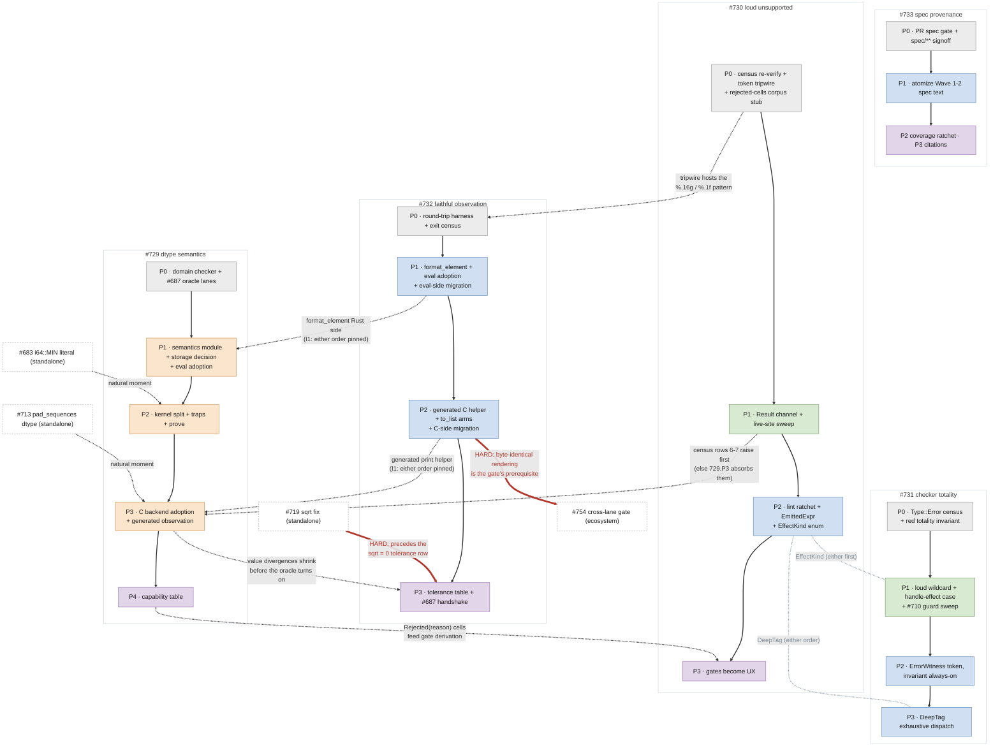

# Numeric Remediation Roadmap: sequencing, ownership, and the ledgers

**Status:** Living coordination document for the plan set that came out of
the 2026-07 numeric audit. This doc owns three things nothing else owns:
the **global sequencing** across the five plans, the **unclaimed-issue
ledger** (every filed issue that no plan's kill table claims, with its
assigned home), and the **deferred-evidence ledger** (claims still resting
on inspection, each with its verification task). It contains NO contracts
of its own - contracts live in the five plans; when this doc and a plan
disagree, the plan wins and this doc has a bug.

The plan set: [`dtype_semantics.md`](dtype_semantics.md) ([#729]), [`loud_unsupported.md`](loud_unsupported.md) ([#730]),
[`checker_totality.md`](checker_totality.md) ([#731]), [`faithful_observation.md`](faithful_observation.md) ([#732]),
[`spec_provenance.md`](spec_provenance.md) ([#733]), plus the [`capability_table.md`](capability_table.md) schema (rides
[#729] Phase 4) and the audit record under `docs/investigations/`.

## The class map

| meta (the class) | method (design spec) | tracker |
|---|---|---|
| [#727] no dtype's semantics enforced at any single point ([#695] = its integer instance) | [`dtype_semantics.md`](dtype_semantics.md) - per-dtype finalizer behind private constructors, int/float kernel split, one storage decision, generated backend dispatch | [#729] |
| [#703] unsupported cases substitute values instead of failing | [`loud_unsupported.md`](loud_unsupported.md) - Result-typed failure channel, the 18-row census sweep, un-writability ratchets (lint, newtype, tripwire), gates demoted to UX | [#730] |
| [#709] unrecognized constructs silently exempt from checking (+[#710]'s silent half) | [`checker_totality.md`](checker_totality.md) - loud wildcard + handle-effect case, ErrorWitness token (silent Type::Error unconstructible), totality invariant, DeepTag exhaustiveness | [#731] |
| [#728] the observation channel is not dtype-faithful | [`faithful_observation.md`](faithful_observation.md) - one Rust formatter, generated C print helper, round-trip invariant, tolerance table; landable before [#729]; unblocks [#687] | [#732] |
| spec silence + stale claims ([#694]; the unauthored cells) | [`spec_provenance.md`](spec_provenance.md) - hash-addressed spec atoms, lint-checked @spec claims, test-carrier coverage, the PR authority gate | [#733] |

Supporting: [`capability_table.md`](capability_table.md) (schema; rides [#729] Phase 4),
[`docs/agent_quality_architecture.md`](../../docs/agent_quality_architecture.md) ([#740]), the seeded atoms
(spec/04 §9-§10, spec/05 §7-§8), and [PR #696](https://github.com/Chelis-Lang/chelis/pull/696) (the acceptance surface).

## Global sequencing

The plans are deliberately independently landable - every pairwise
interlock is pinned in both landing orders (each doc's §I1). The
*recommended* order optimizes for detectors-before-fixes and for
small-wins-early:

**Wave 0 - all five Phase 0s, in any order, immediately.** Each is
afternoon-scale, none touches production code, and together they make
every class regression-visible before anyone fixes anything: the
domain-validity invariant + [#687] oracle lanes ([#729] P0), the substitution
census verification + token tripwire ([#730] P0 - note census row 3 is
already settled: live, [#734]), the `Type::Error` census + red
totality invariant ([#731] P0), the round-trip harness + exit census
([#732] P0), the PR spec gate + `spec/**` signoff ([#733] P0). Two
handshakes qualify "any order": [#732] P0's `%.16g`/`%.1f` grep pattern
lands in [#730] P0's tripwire (land [#730] P0 first or pair the PRs), and
[#729] P0's domain-checker wiring edits the same lane drivers [#732] P0's
harness drives through (sequence or coordinate those two).

**Wave 1 - the small loud fixes.** [#731] Phase 1 (the checker holes -
days) and [#730] Phase 1 (the failure channel + live-site sweep). These
convert every silent-wrong-answer into either a correct answer or a clean
rejection, which shrinks the danger surface before the big refactor and
makes the remaining reds honest.

**Wave 2 - the independently-landable value work.** [#732] Phases 1-2 (the
formatter + generated C side: fixes [#716]/[#723] outright and gives the
refactor its byte-exact instrument) in parallel with [#731] Phases 2-3 (the
witness token + DeepTag) and [#730] Phase 2 (the lint ratchets). [#733]
Phase 1 rides alongside, atomizing whatever spec text Waves 1-2 author.
[#732] Phase 2 additionally gates the ECOSYSTEM's compiled-lane
validation: no shell runs a compiled binary today, and [#754]'s
cross-lane agreement gate (the mechanism [#738]'s conform row points
at) is hard-gated on byte-identical rendering.

**Wave 3 - the semantics refactor.** [#729] Phases 1-3 in order (the
module + storage decision; the kernel split + prove; backend adoption),
validated by everything Waves 0-2 built.

**Wave 4 - the permanent guards.** [#729] Phase 4 delivers the capability
table per [`capability_table.md`](capability_table.md); [#730] Phase 3 (gates become UX) and [#733]
Phase 3 (citations) ship inside it; [#732] Phase 3 (tolerance table +
the [#687] handshake) closes the oracle; [#733] Phase 2's coverage ratchet
turns on for the atomized specs.

Standing exception: any Wave may be entered early for a cell that becomes
urgent - the interlock sections make that safe; this ordering is advice,
not law.

## The dependency DAG

The sequencing above as a graph. NOTE: GitHub renders this as one tall
cascade - a degraded but still correct view. For the intended
side-by-side column layout, open it in VS Code's markdown preview.
Solid arrows are the within-plan phase chains - the only hard sequencing.
Dashed arrows are soft interlocks with a recommended direction; the
alternative order is pinned in the owning docs' §I1 sections. Dotted
arrowless links are shared-component coordination with no inherent
order: [#730] Phase 2 delivers `EffectKind` and [#731] Phase 1 consumes
it (string-match + loud else if it lands first); [#731] Phase 3's
`DeepTag` joins [#730]'s lint enum list, whose freeze anticipates the
addition. The thick red edges are the hard dependencies: inside the
plan set, [#719]'s fix precedes [#732] Phase 3's `sqrt = 0` tolerance
row; downstream of the set, [#754]'s ecosystem gate is hard-gated on
[#732] Phase 2's byte-identical rendering. Not drawn (for legibility):
[#733] Phase 1 atomizes whatever spec text Waves 1-2 author. The graph is acyclic. Node colors are the waves
above: grey = Wave 0, green = Wave 1, blue = Wave 2, orange = Wave 3,
purple = Wave 4 (so [#733] P1, blue, rides Wave 2); white boxes with
dashed borders are standalone fixes outside the wave structure.

## The unclaimed-issue ledger

Filed issues no plan's kill table claimed, each now with an owner. Rule:
an entry leaves this ledger only by appearing in a plan's issue map, in
the capability table's seed decisions, or by being closed.

| issue | what | assigned home |
|---|---|---|
| [#681] | Std.Decimal negative `result_scale` leaks an unbranded error | standalone small fix; diagnostic text should conform to [#730] §C2 when touched. No plan dependency. |
| [#683] | `i64::MIN` not writable as a literal | standalone front-end fix; natural moment is [#729] Phase 2 (the exact int lane makes the round-trip testable), but nothing blocks doing it sooner |
| [#689] | HIP int64 ops emit F32 kernels | two-part: the SILENT half dies at [#730] Phase 1 (`elem_kind` raises); the SUPPORT half is owned by capability-table B-cells `Unimplemented { issue: #689 }` until int64 kernel templates land (see [`capability_table.md`](capability_table.md) seed decisions) |
| [#690] | HIP has no integer div-by-zero guard | rides the same HIP B-cell work as [#689]; the guard is part of `Implemented` for HIP int division cells |
| [#691] | C DAG lane emits fmaxf/fabsf for int64 | owned by capability-table seed decision: B-cells `Unimplemented { issue: #691 }` - the substitution becomes a rejection at [#730] Phase 1 / table landing, correct kernels later |
| [#693] | Metal int64 `abs` zero emission | root cause is [#699] (confirmed by emission); Metal B-cell `Unimplemented { issue: #693 }` until the MSL integer path is wired post-[#699]-fix |
| [#713] | `pad_sequences` allocates int32 output for int64 input | standalone lowering fix; natural moment is [#729] Phase 3 (C host dtype parity), tracked here until claimed there |
| [#719] | vvsqrtf not correctly rounded; layout-dependent results | THE FIX (sqrtf or intrinsic on the contiguous path, one implementation per op) is standalone and must land BEFORE [#732] Phase 3 writes `sqrt = 0` into the tolerance table |
| [#721] | eval cannot ingest the canonical Deep of a nullary fn | standalone eval-ingestion fix; explicitly non-goaled by [#731]; no plan dependency |
| [#734] | `to_string` on tensors/lists compiles to the literal `<value>` | [#730] census row 3 (now live); dies at [#730] Phase 1, unwritable after Phase 2; rendering via [#732]'s formatter |
| [#747] | cli.rs `runtime_library_path()` hard-codes `../../target/debug/deps` (breaks isolated CARGO_TARGET_DIR runs) | standalone test-harness fix; no plan dependency; the per-worktree target symlink is the interim workaround |
| [#750] | compiled lane silently drops def-call-valued top-level roots | silent-omission cousin of [#703]'s class (the skip_for_lowered mechanism, root-output face); standalone fix; [#754]'s output diff catches regressions |
| [#751] | generated C emits uncompilable / sign-losing float constants (f64::MAX as integer literal; -0.0 as `-0`) | ingress, [#729] family; natural moment [#729] Phase 3 (constant emission); [#732]'s harness C_LANE_EXCLUDED cells return when it lands |
| [#754] | shell-invokable cross-lane agreement gate (owner: brittonr) | downstream consumer, not plan-set work: hard-gated on [#732] Phase 2; consumes Phase 3's tolerance artifact and [#729] Phase 4's capability table (cell skipping); GPU lanes join after [#736]/[#737]; [#738] is its consumer; the one-comparator rule is pinned in [#732]'s §C4.3. Scope boundary (2026-07): a verdict proves lane agreement for its RECORDED (target triple, C toolchain + flags incl. -ffp-contract, libm identity) only - never cross-platform determinism by itself; the platform axis compares verdicts across CI matrix entries under the same tolerance table |

Also tracked to closure but already claimed (listed for completeness):
[#680]/[#684]/[#685]/[#686]/[#688] -> [#729]; [#682]/[#692]/[#697]/[#698]/[#699]/[#704]/[#705]/[#725] ->
[#730] (both halves: the builtin-coverage half at Phase 1's typed emitter,
the gate half at Phase 3's dedupe); [#709]/[#710] -> [#731]; [#716]/[#723] -> [#732]; [#694] -> [#733]; [#711]/[#720] ->
[#729] Phase 2 / [#720]'s own note; [#712]/[#715]/[#724]/[#726] -> capability table
seed decisions; [#722] -> [#730] Phase 1 (loud) then [#729]/table (computed).
Wave 0's own discoveries, claimed at filing: [#744]/[#745] -> [#730]
(census rows 13/19, Phase 1 raises); [#748]/[#749] -> [#732] Phase 2
(the generated formatter kills both); [#753] -> [#729] (spec/04
[04-NUM-7] + the capability seed row); [#755]/[#756] -> [#731] (census
extensions; die at the Phase 1-2 sweep and witness migration).

## The deferred-evidence ledger

Claims resting on inspection or partial execution, per the audit's own
standard ("execute everything"). Each has a tracked task.

| item | current evidence | task |
|---|---|---|
| HIP runtime behavior ([#689]/[#690] symptoms at runtime) | emission-proven only; the audit machine (arm64 macOS) has no hipcc | [#736]: run the archived probes on the gfx1151 box via `scripts/hip_test.py` per `docs/local_hip_environment.md`; attach outputs; update both issues' evidence lines |
| Metal runtime execution (typed kernels actually computing) | emission-locked (`metal_dtype_emission_and_bool_add.rs`); never executed | [#737]: a small driver harness (main.mm + chelis runtime link) on an arm64 Mac; promote the emission locks to run locks |
| [#688]'s opaque produced-value chokepoint (`flatten_field_value`) | the CLASS is executed (spurious fuzz-tier counterexample); the cited site is not | tracked on [#688] itself: needs `--features smt` + an `@opaque` int64-field type; exact repro sketch is in the issue comments |
| `with seed` / `with device` semantics (cross-lane seeding reproducibility) | never swept; both [#730] and [#731] explicitly non-goal it | [#735]: spec-gap issue - author the semantics (atoms, per [#733]), then sweep both lanes |
| shell repos' compiled-lane numerics (school validates eval-only) | audit note, unexecuted downstream | [#738]: conform-contract amendment proposal - shells gain a compiled-lane numerical row |
| census rows 13-16 of [#730] (dead-by-probe placeholder sites) | probed dead or dead-by-inspection | re-verified mechanically at [#730] Phase 0; §C1.4 raise-or-prove applies regardless |

(Filed: [#735] effects, [#736] HIP runtime, [#737] Metal harness, [#738] shell
lanes.)

## Effects: the one semantic area with no owner

Called out beyond the ledger because it is a spec-silence case (the
exact [#733] shape) and not merely missing evidence: nothing anywhere
states what `with seed(n)` guarantees (determinism? cross-lane
reproducibility? scope of the seed?), what `with device` selects, or
what either means under `grad`/`vmap`. [#731] will make their BODIES
type-checked and [#730] will make unknown KINDS loud, but the meaning
stays unauthored - the same undecided-cell condition that produced
[#724]/[#726], one construct over. Owned by [#735]; its
output is atoms plus a sweep, not code.

[#680]: https://github.com/Chelis-Lang/chelis/issues/680
[#681]: https://github.com/Chelis-Lang/chelis/issues/681
[#682]: https://github.com/Chelis-Lang/chelis/issues/682
[#683]: https://github.com/Chelis-Lang/chelis/issues/683
[#684]: https://github.com/Chelis-Lang/chelis/issues/684
[#685]: https://github.com/Chelis-Lang/chelis/issues/685
[#686]: https://github.com/Chelis-Lang/chelis/issues/686
[#687]: https://github.com/Chelis-Lang/chelis/issues/687
[#688]: https://github.com/Chelis-Lang/chelis/issues/688
[#689]: https://github.com/Chelis-Lang/chelis/issues/689
[#690]: https://github.com/Chelis-Lang/chelis/issues/690
[#691]: https://github.com/Chelis-Lang/chelis/issues/691
[#692]: https://github.com/Chelis-Lang/chelis/issues/692
[#693]: https://github.com/Chelis-Lang/chelis/issues/693
[#694]: https://github.com/Chelis-Lang/chelis/issues/694
[#695]: https://github.com/Chelis-Lang/chelis/issues/695
[#696]: https://github.com/Chelis-Lang/chelis/pull/696
[#697]: https://github.com/Chelis-Lang/chelis/issues/697
[#698]: https://github.com/Chelis-Lang/chelis/issues/698
[#699]: https://github.com/Chelis-Lang/chelis/issues/699
[#703]: https://github.com/Chelis-Lang/chelis/issues/703
[#704]: https://github.com/Chelis-Lang/chelis/issues/704
[#705]: https://github.com/Chelis-Lang/chelis/issues/705
[#709]: https://github.com/Chelis-Lang/chelis/issues/709
[#710]: https://github.com/Chelis-Lang/chelis/issues/710
[#711]: https://github.com/Chelis-Lang/chelis/issues/711
[#712]: https://github.com/Chelis-Lang/chelis/issues/712
[#713]: https://github.com/Chelis-Lang/chelis/issues/713
[#715]: https://github.com/Chelis-Lang/chelis/issues/715
[#716]: https://github.com/Chelis-Lang/chelis/issues/716
[#719]: https://github.com/Chelis-Lang/chelis/issues/719
[#720]: https://github.com/Chelis-Lang/chelis/issues/720
[#721]: https://github.com/Chelis-Lang/chelis/issues/721
[#722]: https://github.com/Chelis-Lang/chelis/issues/722
[#723]: https://github.com/Chelis-Lang/chelis/issues/723
[#724]: https://github.com/Chelis-Lang/chelis/issues/724
[#725]: https://github.com/Chelis-Lang/chelis/issues/725
[#726]: https://github.com/Chelis-Lang/chelis/issues/726
[#727]: https://github.com/Chelis-Lang/chelis/issues/727
[#728]: https://github.com/Chelis-Lang/chelis/issues/728
[#729]: https://github.com/Chelis-Lang/chelis/issues/729
[#730]: https://github.com/Chelis-Lang/chelis/issues/730
[#731]: https://github.com/Chelis-Lang/chelis/issues/731
[#732]: https://github.com/Chelis-Lang/chelis/issues/732
[#733]: https://github.com/Chelis-Lang/chelis/issues/733
[#734]: https://github.com/Chelis-Lang/chelis/issues/734
[#735]: https://github.com/Chelis-Lang/chelis/issues/735
[#736]: https://github.com/Chelis-Lang/chelis/issues/736
[#737]: https://github.com/Chelis-Lang/chelis/issues/737
[#738]: https://github.com/Chelis-Lang/chelis/issues/738
[#740]: https://github.com/Chelis-Lang/chelis/issues/740
[#744]: https://github.com/Chelis-Lang/chelis/issues/744
[#745]: https://github.com/Chelis-Lang/chelis/issues/745
[#747]: https://github.com/Chelis-Lang/chelis/issues/747
[#748]: https://github.com/Chelis-Lang/chelis/issues/748
[#749]: https://github.com/Chelis-Lang/chelis/issues/749
[#750]: https://github.com/Chelis-Lang/chelis/issues/750
[#751]: https://github.com/Chelis-Lang/chelis/issues/751
[#753]: https://github.com/Chelis-Lang/chelis/issues/753
[#754]: https://github.com/Chelis-Lang/chelis/issues/754
[#755]: https://github.com/Chelis-Lang/chelis/issues/755
[#756]: https://github.com/Chelis-Lang/chelis/issues/756
