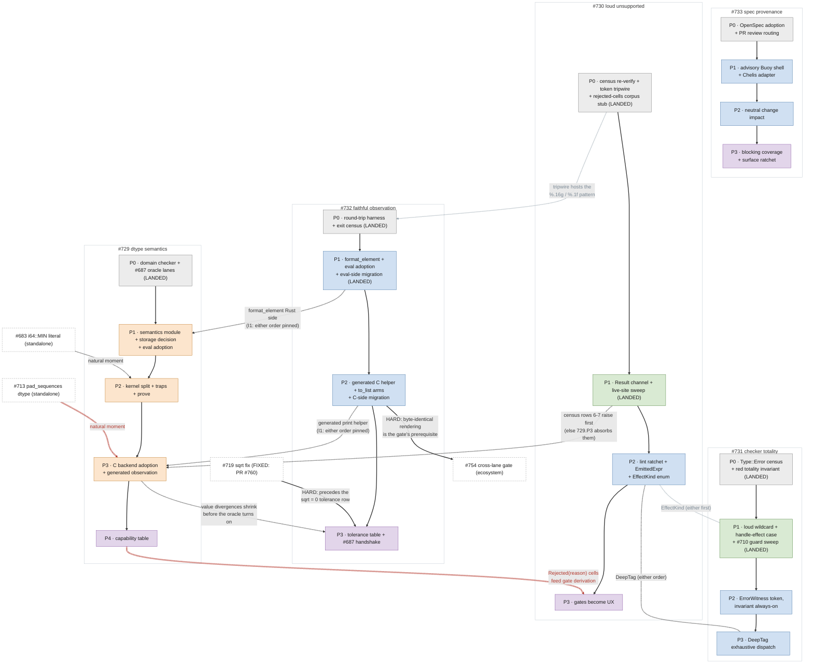

# Numeric Remediation Roadmap: sequencing, ownership, and the ledgers

**Status:** Living coordination document for the plan set that came out of
the 2026-07 numeric audit. This doc owns four things nothing else owns:
the **global sequencing** across the five plans, the **release boundaries**
(where the version cuts fall, sliced to keep each downstream-shell bump
digestible and never temporary), the **unclaimed-issue ledger** (every filed
issue that no plan's kill table claims, with its assigned home), and the
**deferred-evidence ledger** (claims still resting on inspection, each with
its verification task). It contains NO contracts
of its own - contracts live in the five plans; when this doc and a plan
disagree, the plan wins and this doc has a bug.

The plan set: [`dtype_semantics.md`](dtype_semantics.md) ([#729]), [`loud_unsupported.md`](loud_unsupported.md) ([#730]),
[`checker_totality.md`](checker_totality.md) ([#731]), [`faithful_observation.md`](faithful_observation.md) ([#732]),
[`spec_provenance.md`](spec_provenance.md) ([#733]), plus the [`capability_table.md`](capability_table.md) schema (rides
[#729] Phase 4) and the audit record under `docs/investigations/`.

## The class map

| meta (the class) | method (design spec) | tracker |
|---|---|---|
| [#727] no dtype's semantics enforced at any single point ([#695] = its integer instance) | [`dtype_semantics.md`](dtype_semantics.md) - per-dtype finalizer behind private constructors, int/float kernel split, one storage decision, generated backend dispatch | [#729] |
| [#703] unsupported cases substitute values instead of failing | [`loud_unsupported.md`](loud_unsupported.md) - Result-typed failure channels, the census sweep, dependency-bottom closed identities, fail-closed HostType/ABI states, structured emission, and gates demoted to UX | [#730] |
| [#709] unrecognized constructs silently exempt from checking (+[#710]'s silent half) | [`checker_totality.md`](checker_totality.md) - loud wildcard + handle-effect case, ErrorWitness token (silent Type::Error unconstructible), totality invariant, DeepTag exhaustiveness | [#731] |
| [#728] the observation channel is not dtype-faithful | [`faithful_observation.md`](faithful_observation.md) - one Rust formatter, generated C print helper, round-trip invariant, tolerance table; landable before [#729]; unblocks [#687] | [#732] |
| spec silence + stale claims ([#694]; the unauthored cells) | [`spec_provenance.md`](spec_provenance.md) - OpenSpec plans changes after Phase 0 activation, while a pinned Buoy shell and one-way Chelis adapter provide repository-independent authority, freshness, coverage, and impact enforcement; design/fixtures may proceed now, advisory execution waits for Buoy's final oracle, and blocking waits for the adapter and Chelis configuration oracles | [#733] |

Supporting: [`capability_table.md`](capability_table.md) (schema; rides [#729] Phase 4),
[`docs/agent_quality_architecture.md`](../../docs/agent_quality_architecture.md) ([#740]), the seeded atoms
(spec/04 §9-§10, spec/05 §7-§8), and [PR #696](https://github.com/Chelis-Lang/chelis/pull/696) (the acceptance surface).

## Global sequencing

The plans are deliberately independently landable - every pairwise
interlock is pinned in both landing orders (each doc's §I1). The
*recommended* order optimizes for detectors-before-fixes and for
small-wins-early:

**Wave 0 - all five Phase 0s, in any order, immediately.** STATUS
2026-07-20: four of five LANDED 2026-07-17 - the domain-validity
invariant + [#687] oracle lanes ([#729] P0, PR #758), the substitution
census verification + token tripwire ([#730] P0, PR #746), the
`Type::Error` census + red totality invariant ([#731] P0, PR #757 -
`issue_731_totality_invariant.rs`), the round-trip harness + exit
census ([#732] P0, PR #752). The one outstanding Wave 0 item is OpenSpec
activation + PR review routing + `spec/**` signoff ([#733] P0). The design PR
does not activate that workflow; Phase 0's configuration, instructions, and
oracle do. Phase 0 makes no Buoy assurance claim and keeps OpenSpec and
provider metadata outside canonical product authority. The two ordering
handshakes
(the `%.16g`/`%.1f` grep pattern landing in [#730] P0's tripwire; [#729]
P0 and [#732] P0 sharing lane drivers) were honored and are now
historical.

**Wave 1 - the small loud fixes.** STATUS 2026-07-20: COMPLETE. [#731]
Phase 1 (the checker holes: loud wildcard, the handle-effect case, the
seed-literal diagnostic, the MalformedForm sweep) merged as PR #793;
[#730] Phase 1 (the Unsupported Result channel with the speculative-
sub-lowering laundering path closed structurally, every live census row
converted) merged as PR #791. [#732] Phase 1 (the formatter + eval
adoption + the eval-side migration, a Wave 2 item entered early per the
standing exception) merged as PR #792 the same day. All three were
fresh-context red-teamed (QUALIFIED PASS x3) with every confirmed
finding folded in before merge; the red teams' discoveries are filed as
[#794]/[#795]/[#796].

**Wave 2 - the independently-landable value work.** [#732] Phase 1
landed with Wave 1 (above); the remaining Wave 2 set is [#732] Phase 2
(the generated C side: fixes [#716]/[#723] outright and gives the
refactor its byte-exact instrument) in parallel with [#731] Phases 2-3 (the
witness token + DeepTag) and [#730] Phase 2 (typed closed vocabularies,
HostType/ABI separation, and structured emission; lexical ratchets remain
supporting checks). [#733]'s
OpenSpec track rides alongside (per the 2026-07-20 re-scope): new
normative text Waves 1-2 author is born with atom IDs and goes through
the OpenSpec claim flow; the rev/lint machinery (the re-scoped Phase 1)
stays deferred.
[#732] Phase 2 additionally gates the ECOSYSTEM's compiled-lane
validation: no shell runs a compiled binary today, and [#754]'s
cross-lane agreement gate (the mechanism [#738]'s conform row points
at) is hard-gated on byte-identical rendering.

**Wave 3 - the semantics refactor.** [#729] Phases 1-3 in order (the
module + storage decision; the kernel split + prove; backend adoption),
validated by everything Waves 0-2 built.

**Wave 4 - the permanent guards.** [#729] Phase 4 delivers the capability
table per [`capability_table.md`](capability_table.md); [#730] Phase 3 (gates become UX) and [#733]
Phase 3 (the first blocking provenance ratchet) ships with it only after
the advisory Buoy pilot and change-impact phases are green; [#732] Phase 3
(the tolerance table + the [#687] handshake) closes the oracle. Citation
presence may land before blocking freshness and coverage, but every
selected capability row ultimately binds one current controlling atom
revision.

Standing exception: any Wave may be entered early for a cell that becomes
urgent - the interlock sections make that safe; this ordering is advice,
not law.

## The dependency DAG

The sequencing above as a graph. NOTE: GitHub renders this as one tall
cascade - a degraded but still correct view. For the intended
side-by-side column layout, open it in VS Code's markdown preview.
Solid arrows are the within-plan phase chains - the only hard sequencing.
Dashed arrows are soft interlocks with a recommended direction; the
alternative order is pinned in the owning docs' §I1 sections. Dotted
arrowless links are shared-component coordination with no inherent
order: [#730] Phase 2 delivers `EffectKind` and [#731] Phase 1 consumes
it (string-match + loud else if it lands first); [#731] Phase 3's
`DeepTag` joins [#730]'s lint enum list, whose freeze anticipates the
addition. The thick red edges are the hard dependencies: inside the
plan set, [#719]'s fix precedes [#732] Phase 3's `sqrt = 0` tolerance
row (SATISFIED 2026-07-17: PR #760 merged, [#719] closed - the row may
be authored when Phase 3 arrives); downstream of the set, [#754]'s
ecosystem gate is hard-gated on [#732] Phase 2's byte-identical
rendering. Not drawn (for legibility): OpenSpec remains [#733]'s planning
workflow while a pinned Buoy shell and one-way Chelis adapter provide
enforcement.
The graph is acyclic. Node colors
are the waves above: grey = Wave 0, green = Wave 1, blue = Wave 2, orange =
Wave 3, purple = Wave 4 (so [#733]'s advisory Buoy pilot, blue, may ride Wave
2); white boxes with dashed borders are standalone fixes outside the wave
structure. LANDED marks the four Phase 0s merged 2026-07-17 and the three
Phase 1s merged 2026-07-20 (PRs #793/#792/#791).

## Release slicing: where the version cuts fall

Sequencing above is about *phase dependencies*; this section is about *release
boundaries* - a different axis. The plans are independently landable, so a
version cut can fall wherever a coherent set of phases is green; the thing that
decides *where* is **downstream-shell migration cost**, not the internal wave
numbers.

The governing rule: **every release moves a shell-facing surface to its FINAL
state, or does not touch it at all.** The failure mode to avoid is a surface
that lands in an intermediate state a shell must adapt to and then re-adapt to
- silent to loud to supported in three separate bumps, `seed(42)` to `42i64`
to some third form, render-shape A to B to C. A one-time break shells absorb
once is cheap; a break they make and later unmake is the expensive kind. Like
the sequencing above, this ordering is advice, not law; a cut may move if a
cell becomes urgent.

Baseline (2026-07): the shipped release is **v0.16.1**; everything merged since
- the Phase 1s (PRs #791/#792/#793) and the ordinary work alongside them - sits
on `main` unreleased. Step zero is to cut it as v0.17.0. A cut's migration note
is the **breaking-change summary**, not the full release contents: most of what
a cut carries is ordinary work, and only the deltas called out below force a
downstream change.

### What actually forces a downstream change

| class | shell-visible change | cost |
|---|---|---|
| A - syntax migration | `with seed(42)` -> `42i64` ([#731] P1) | one-time, final |
| B - loud rejection of silently-wrong code | [#730]/[#731]/[#729] loud paths, [#730] P2 host-type | shells fix a real bug; permanent |
| C - wire / binding break | [#729] §C3 per-dtype storage (schema + Python payload) | one-time; **must be atomic** (§C3 forbids partial adoption) |
| D - rendering change | [#732] printed-output strings | churn ONLY if one lane changes twice |
| E - reject-now-support-later | [#730] loud reject -> [#729] kernel lands | the add-then-remove-workaround trap |

The class-E anti-churn tool is the capability *decision* itself: whether a cell
is supported or a stable, cited `Unimplemented { issue: #N }` rejection is a
behavior fact, and **every such decision ships in v0.19 with the dtype break** -
never deferred to the v0.20 table. A shell then writes the `chelis#N` narrowing
citation once, against 0.19, and removes it only when the kernel actually lands
- a real event, not a slicing artifact. The v0.20 table only *mechanizes*
decisions 0.19 already made, so it is behavior-preserving by construction.

### The cuts

| cut | carries | shell impact | notes |
|---|---|---|---|
| **v0.17.0 - loud checking + canonical eval rendering** (ship now) | [#730] P1 + [#731] P1 + [#732] P1, and everything else merged since 0.16.1 | **source migration** (wave 1) | breaking deltas only: loud rejections (incl. the new loud compiled-lane `test_*` assert, [#796] - the old inert-`0` stub is gone, so anything leaning on it fails heavily in E2E), `with seed(n)` -> `42i64` ([#731] P1 - the Shoals / Whale / hello-chelis HEAD canaries fail on unsuffixed seeds), and dtype-faithful eval rendering. Seed form frozen ([#735] changes only meaning); eval render frozen (C matches it at 0.18) |
| **v0.18.0 - checker totality, DeepTag, host-type/ABI boundary, compiled rendering** | [#731] P2 (PR #800) + [#731] P3 (DeepTag) + [#730] P2 (PR #799 vocab + host-type/ABI state) + [#732] P2 (compiled render) | **mechanical** for shells | no wire break ([#730] P2 preserves the `CHELIS_*` ids); the added loudness lands on already-broken code, so no *expected* source migration. Completes byte-identical rendering. Release-hygiene gate: the tarball must now ship `chelis_runtime_dtype.h` - PR 799's public `chelis_runtime.h` `#include`s it, but the release workflow currently copies only `chelis_runtime.h` |
| **v0.19.0 - grounded dtype storage/wire break + every behavior-changing capability decision** | [#729] P1-P3 landed atomic per §C3, **plus every capability decision that changes behavior** - integer-overflow traps and each supported-vs-`Unimplemented` disposition (int `mean` [#724], bool arithmetic [#726], the [#715] rows, the HIP/Metal/C reject cells) | **source migration** (wave 2) | the one wire break, isolated from the checker-loudness cuts; class E resolves here, not at the 0.20 table. Bindings adapt to the per-dtype payload once; capability behavior is final |
| **v0.20.0 - behavior-preserving permanent guards** | [#729] P4 (the capability *table*, mechanizing 0.19's decisions) + [#730] P3 (gates -> UX) + [#732] P3 (tolerance / cross-lane oracle) + [#733] P3 (first blocking provenance ratchet) | **mechanical** for shells | guaranteed behavior-preserving: no decision, rejection, or rendered byte changes here - 0.19 shipped them all. [#733] P0 lands independently before this cut, while its P1-P2 advisory integration is a prerequisite rather than v0.20 release payload. `tests_blocked/` probes are re-adjudicated against the now-standing table |

Net downstream shape: there are **four mechanical `conform` bump waves** - one
per cut, each a pin bump plus a probe re-run and an inventory refresh - but only
**two expected source-migration waves**: **v0.17** (seed suffix + fixing
loud-rejected code) and **v0.19** (the wire break + capability behavior). At
v0.18 and v0.20 shells bump the pin and change no source. In none of the four
does a shell make a change it later reverses.

Cadence for non-contract work: an **internal-only** change (a refactor, a
checker-internal fix, doc-only work) normally **rides the next planned cut**
rather than getting its own release; only an **urgent downstream bug fix** - a
shell blocked on a real defect - justifies an out-of-band patch release. PR
#819's `compile_and_load` metadata fix qualifies for a patch only if a shell
needs it now; otherwise it rides 0.18.

### The anti-churn invariants

1. **Atomic wire break.** [#729] §C3 is all-layers-or-nothing; never split the
   storage decision across releases or binding consumers adapt N times.
2. **Per-lane-render-once.** [#732] freezes the eval render at P1 and the C
   render at P2; a given lane never changes shape twice. Keep P1/P2 in
   different cuts but tell cross-lane shells P1 is "eval-final, C follows at
   0.18".
3. **Frozen seed form.** [#731] P1's `i64` suffix is the final syntax; [#735]
   authors only meaning. Safe to ship to shells at 0.17.
4. **Decisions before tables.** Every behavior-changing capability decision
   (supported vs a stable, cited `Unimplemented { issue }`) ships in v0.19; the
   v0.20 table only mechanizes them. Never leave a bare loud error in one cut
   that a later cut reclassifies - a shell cites once, against 0.19.
5. **v0.20 is mechanically behavior-preserving.** If any change in the guards
   cut would alter a result, a rejection, or a rendered byte, it belongs in 0.19
   instead. That guarantee is what lets shells treat the 0.20 bump as pin-only.
6. **Ship what the public headers include.** A release whose public runtime
   header gains an `#include` (0.18's `chelis_runtime_dtype.h`) must add that
   file to every tarball; a published-artifact smoke that compiles a trivial C
   unit against the shipped `chelis_runtime.h` catches the omission before it
   reaches a downstream build.

### Per-cut conform checklist

Every cut gets a mechanical `conform bump` PR wave across the shells; the two
source-migration cuts (0.17, 0.19) additionally carry real source edits. Each
wave carries:

- a migration note as the **breaking-change summary** (the delta below), the
  `chelis#NNN` refs it closes, and the exact surface that changed - not the full
  changelog;
- a re-run of every shell's `tests_blocked/` probes (a probe flipping green =
  remove the narrowing citation for that ref);
- the multi-location pin-consistency guard and the `docs/CHELIS_SURFACE.md`
  capability-inventory refresh;
- a published-artifact smoke that compiles a trivial C unit against the shipped
  `chelis_runtime.h`, so a header the release forgot to package (0.18's
  `chelis_runtime_dtype.h`) fails the release, not the downstream build;
- at 0.19 only: the wire-schema version bump acknowledged at each Python
  consumer.

Migration-note stubs (the breaking delta per cut):

- **0.17** (source migration) - "`check`/`build` now fail loudly where they
  silently substituted (incl. compiled-lane `test_*` asserts, which no longer
  stub to an inert `0`); `with seed(n)` requires an `i64`-suffixed literal
  (`seed(42i64)`); eval output is dtype-faithful (integers print as integers).
  Known HEAD-canary casualties: Shoals, Whale, hello-chelis (unsuffixed seeds),
  plus any E2E leaning on the old assert stub."
- **0.18** (mechanical) - "pin bump only: more previously-silent errors are
  caught (bogus casts, non-record field access, malformed host types) but on
  already-broken code; compiled and eval output now render byte-identically; the
  runtime tarball gains `chelis_runtime_dtype.h`."
- **0.19** (source migration) - "dtype semantics are grounded: integer overflow
  traps instead of wrapping, per-dtype tensor storage (wire-format v2, Python
  payload shape changed), narrow dtypes preserved end-to-end; every op x dtype
  capability decision is now fixed (supported, or a cited stable rejection)."
- **0.20** (mechanical) - "pin bump only: the capability table, gates-as-UX,
  [#733] Phase 3 blocking provenance ratchet, and the cross-lane oracle land;
  Phase 0 landed independently and Phases 1-2 were advisory prerequisites. All
  encoding decisions already shipped in 0.19 - no behavior change."

### Tag gate and the 0.17 sequence

A source-migration cut separates two kinds of breakage, handled differently:

- **Repo-owned** failures gate the tag. The heavy E2E failures from the new
  loud compiled-lane `test_*` rejection ([#796]) are the repo's own tests and
  **must be green before tagging** - a cut is never tagged over a red repo E2E.
- **Shell-owned** failures do not gate the tag; they are the *expected*
  migration signal (the Shoals / Whale / hello-chelis HEAD canaries failing on
  unsuffixed seeds). Their `conform` bump fixes are **prepared before the tag**
  so shells migrate promptly once it lands.

The 0.17 sequence, concretely:

1. Merge the corrected release-slicing change (this PR).
2. Once the repo-owned `test_*` E2E is green, make the short-lived 0.17 release
   commit and tag it.
3. Verify the published assets (the header smoke: every `#include`d runtime
   header is in the tarball).
4. Start the shell `conform` bump migrations (the seed-suffix fixes, prepared
   in advance).
5. Merge PR #800 (the 0.18 witness work) only afterward - it does not ride 0.17.

## The unclaimed-issue ledger

Filed issues no plan's kill table claimed, each now with an owner. Rule:
an entry leaves this ledger only by appearing in a plan's issue map, in
the capability table's seed decisions, or by being closed.

| issue | what | assigned home |
|---|---|---|
| [#681] | Std.Decimal negative `result_scale` leaks an unbranded error | standalone small fix; diagnostic text should conform to [#730] §C2 when touched. No plan dependency. |
| [#683] | `i64::MIN` not writable as a literal | standalone front-end fix; natural moment is [#729] Phase 2 (the exact int lane makes the round-trip testable), but nothing blocks doing it sooner |
| [#689] | HIP int64 ops emit F32 kernels | two-part: the SILENT half dies at [#730] Phase 1 (`elem_kind` raises); the SUPPORT half is owned by capability-table B-cells `Unimplemented { issue: #689 }` until int64 kernel templates land (see [`capability_table.md`](capability_table.md) seed decisions) |
| [#690] | HIP has no integer div-by-zero guard | rides the same HIP B-cell work as [#689]; the guard is part of `Implemented` for HIP int division cells |
| [#691] | C DAG lane emits fmaxf/fabsf for int64 | owned by capability-table seed decision: B-cells `Unimplemented { issue: #691 }` - the substitution becomes a rejection at [#730] Phase 1 / table landing, correct kernels later |
| [#693] | Metal int64 `abs` zero emission | root cause is [#699] (confirmed by emission); Metal B-cell `Unimplemented { issue: #693 }` until the MSL integer path is wired post-[#699]-fix |
| [#713] | `pad_sequences` allocates int32 output for int64 input | standalone lowering fix; natural moment is [#729] Phase 3 (C host dtype parity), tracked here until claimed there |
| [#734] | `to_string` on tensors/lists compiles to the literal `<value>` | [#730] census row 3 (now live); dies at [#730] Phase 1, unwritable after Phase 2; rendering via [#732]'s formatter |
| [#751] | generated C emits uncompilable / sign-losing float constants (f64::MAX as integer literal; -0.0 as `-0`) | ingress, [#729] family; natural moment [#729] Phase 3 (constant emission); [#732]'s harness C_LANE_EXCLUDED cells return when it lands |
| [#754] | shell-invokable cross-lane agreement gate (owner: brittonr) | downstream consumer, not plan-set work: hard-gated on [#732] Phase 2; consumes Phase 3's tolerance artifact and [#729] Phase 4's capability table (cell skipping); GPU lanes join after [#736]/[#737]; [#738] is its consumer; the one-comparator rule is pinned in [#732]'s §C4.3. Scope boundary (2026-07): a verdict proves lane agreement for its RECORDED (target triple, C toolchain + flags incl. -ffp-contract, libm identity) only - never cross-platform determinism by itself; the platform axis compares verdicts across CI matrix entries under the same tolerance table. Platform priority (Jeff, 2026-07-20): server-side Linux x86-64 is the primary verdict platform before any wider matrix. The -ffp-contract entry in the provenance flag set now has a measured in-house exemplar: the pre-[#770]-fix `uniform_like` affine was contraction-dependent (PR #779 removed the sensitivity at the source) |
| [#763] | `chelis lane-check` - the exact-only, Nix-hermetic first slice of [#754] (owner: brittonr) | child of the [#754] row: same one-comparator rule and proof-scope boundary; for its exact-safe corpus, byte-identity holds TODAY (the parity corpus diet, verified 2026-07-17), so [#732] Phase 2 is the corpus-EXPANSION unlock rather than a ship blocker; the initial corpus curates around [#751] (uncompilable float constants) and [#761] (subnormal ingress flush) |
| [#761] | C lane flushes f32 subnormal literals to zero at ingress (the to_tensor route; found by [#719]'s fix session) | ingress, [#729] family ([04-NUM-2] requires subnormal-preserving narrowing); distinct from [#748] (rendering), whose print collapse masks this value-loss class in print-based checks; natural moment [#729] Phase 3 (C host dtype parity) or standalone earlier; blocks the subnormal locks in [#719]'s and [#732]'s suites until fixed |
| [#775] | scalar top-level roots render as a rank-0 tensor in eval but a bare scalar in compiled C (value and line count agree; shape diverges; unmasked, not caused, by [#750]'s fix) | [#732]'s concrete acceptance case for its Phase 1 scalar-root rendering decision. Disposition (Jeff, 2026-07-18): deliberately fixed in NEITHER lane now - [05-OBS-1..3] and the container rule do not decide it, and a unilateral pick would preempt the one-formatter-both-lanes contract; the [#732] P0 harness pins the divergence as deliberately-undriven until Phase 1 decides |
| [#780] | matmul shape checking lost through an unannotated lambda parameter - a Surf-reachable false green (found in [#773]'s red team; pre-existing on both sides of the [#773] fix) | [#731] family: a silent unresolved-var acceptance, the deferral-shaped cousin of silent `Type::Error`; sequenced behind [#731] Phase 1-2 rather than fixed standalone so lambda-param binding/re-check semantics are decided once inside the track |
| [#783] | annotation writeback degrades an unresolved Var to a rank-0 default and clobbers a concrete annotation (a silent [#703]-class substitution; the enabler of the transient [#773]-fix conv2d ICE, hotfixed same day) | sits between [#731] (the silent-degradation discipline) and [#730] (the substitution shape): the durable invariant is covered-or-rejected on the type-metadata channel - never replace a concrete annotation with a degraded one silently. Not urgent: the known trigger is guarded (all eleven shape-computed overrides), regression-locked by `issue_778_conv2d_annotation_clobber.rs` |
| [#794] | `.dp`-reachable lowering-side value substitutions the PR #793 red team confirmed: `extract_f64_value`'s catch-all folds a `(par ...)` bound's FIRST child (spec/03 says last), and `extract_usize_value` silently maps a negative `.dp` int64 seed to 0 | [#730] census extension rows. The checker side is already closed (PR #793 narrowed its accept-set to `lit` and rejects negative literal seeds), so both are checker-unreachable today - the lowering fix is defense-in-depth per §C1.4 |
| [#795] | conv2d's present-but-non-literal stride/padding fall to `unwrap_or(1)`/`unwrap_or(0)` in lower.rs (the [#776] value-default shape; census row 23, discovered in [#730] Phase 1's sweep) | [#730] census row 23; liveness honestly not-execution-confirmed (the checker's shape rules may cover it) - §C1.4 raise-or-prove; tripwire-baselined interim |
| [#796] | compiled-lane `test_*` assertion builtins: pre-[#730]-P1 binaries compiled assertions to inert `0` stubs (could never fail); now loudly rejected | op-owner work: real C emission arms, or an authored eval-only contract + an earlier gate; surfaced by [#730] Phase 1's bucket3 adjudication |

Also tracked to closure but already claimed (listed for completeness):
[#680]/[#684]/[#685]/[#686]/[#688] -> [#729]; [#682]/[#692]/[#697]/[#698]/[#699]/[#704]/[#705]/[#725] ->
[#730] (both halves: the builtin-coverage half at Phase 1's typed emitter,
the gate half at Phase 3's dedupe); [#709]/[#710] -> [#731]; [#716]/[#723] -> [#732]; [#694] -> [#733]; [#711]/[#720] ->
[#729] Phase 2 / [#720]'s own note; [#712]/[#715]/[#724]/[#726] -> capability table
seed decisions; [#722] -> [#730] Phase 1 (loud) then [#729]/table (computed).
Wave 0's own discoveries, claimed at filing: [#744]/[#745] -> [#730]
(census rows 13/19, Phase 1 raises); [#748]/[#749] -> [#732] Phase 2
(the generated formatter kills both); [#753] -> [#729] (spec/04
[04-NUM-7] + the capability seed row); [#755]/[#756] -> [#731] (census
extensions; die at the Phase 1-2 sweep and witness migration).

Closed by the 2026-07-18/19 fix batch and removed from the ledger
above: [#747] (PR #767), [#721] (PR #768), [#750] (PR #774). Filed and
fixed inside the same batch, never ledgered: the [#735] sweep's
discoveries [#770] (PR #779), [#771] (PR #777, lane-agreement half;
the reject-diagnostic half stays [#731] Phase 1), and [#776] (PR #782),
plus the standalone [#706] (PR #769) and [#707] (PR #772).

## The deferred-evidence ledger

Claims resting on inspection or partial execution, per the audit's own
standard ("execute everything"). Each has a tracked task.

| item | current evidence | task |
|---|---|---|
| HIP runtime behavior ([#689]/[#690] symptoms at runtime) | **executed on gfx1151** (HIP 7.13, chelis 0.16.1, via `scripts/hip_test.py`): [#689] confirmed - `neg`/`sum` run an `_f32` kernel over the `CHELIS_I64` buffer and return garbage (e.g. `sum([10¹²,2·10¹²,3·10¹²,4·10¹²])` = 3567587328 vs 10¹³; `neg` also drops the upper lanes), while `add`/`mul` (correct `_i64` kernels) and f32 `neg` are exact. [#690] confirmed - HIP `trunc_div` by zero returns silently (exit 0, garbage) where the evaluator aborts branded. Repro archived at `docs/investigations/probes/hip_runtime/`; red-team re-ran the probes (PASS) and the runtime results are posted on [#689](https://github.com/Chelis-Lang/chelis/issues/689#issuecomment-5011825763), [#690](https://github.com/Chelis-Lang/chelis/issues/690#issuecomment-5011825818), and [#736](https://github.com/Chelis-Lang/chelis/issues/736#issuecomment-5011825877) | [#736]: probes executed + posted; both issues off the emission-only caveat |
| Metal runtime execution (typed kernels actually computing) | emission-locked (`metal_dtype_emission_and_bool_add.rs`); never executed | [#737]: a small driver harness (main.mm + chelis runtime link) on an arm64 Mac; promote the emission locks to run locks |
| [#688]'s opaque produced-value chokepoint (`flatten_field_value`) | the CLASS is executed (spurious fuzz-tier counterexample); the cited site is not | tracked on [#688] itself: needs `--features smt` + an `@opaque` int64-field type; exact repro sketch is in the issue comments |
| `with seed` / `with device` semantics (cross-lane seeding reproducibility) | the `with seed` half is SWEPT (2026-07-18 sweep + 2026-07-19 re-sweep on [#735]: eval vs compiled-C host lane, all probes f32-bit-identical post the [#770]/[#771]/[#776] fixes, independently re-run 253/253); [05-RNG-1] shipped (PR #781) | [#735]: remaining authoring - `with device` selection, vmap x seed, grad-through-seeded-draws numerics; GPU/kernel-lane RNG sweep is the [#736] follow-on; the unconditional cross-lane atom's blocker cleared 2026-07-20 ([#731] Phase 1 merged, PR #793) - re-sweep + atom (b) shipment unblocked |
| shell repos' compiled-lane numerics (school validates eval-only) | audit note, unexecuted downstream | [#738]: conform-contract amendment proposal - shells gain a compiled-lane numerical row |
| census rows 13-16 of [#730] (dead-by-probe placeholder sites) | probed dead or dead-by-inspection | re-verified mechanically at [#730] Phase 0; §C1.4 raise-or-prove applies regardless |

(Filed: [#735] effects, [#736] HIP runtime, [#737] Metal harness, [#738] shell
lanes.)

## Effects: split into decided-needs-authoring and genuinely open

Called out beyond the ledger because it is a spec-silence case (the
exact [#733] shape) and not merely missing evidence. Re-scoped per
Jeff's 2026-07 pass on [#735], which grounded it against the LaCaDiLE
formal development (the canonical calculus; our spec text lags it):

- **The effect DISCIPLINE is decided** - handler scoping is syntactic
  (the effect discharges for the body's scope only), nesting shadows
  innermost-first, `with seed`/`with device` compose via distinct
  labels, and grad rejects an unhandled `Random` effect - all backed by
  LaCaDiLE Theorem 3 (mechanized handler calculus). That half is
  spec-atom TRANSCRIPTION behind [#733], not design. Coordination note
  for [#733]: these atoms cite theorems in ANOTHER repo's formal
  development. Buoy's atom revision covers the normative spec text, not the
  external theorem, so the Chelis/Buoy shell integration must define a separate
  cross-repo theorem binding before these atoms land.
- **The RNG-reproducibility call is MADE and partly shipped** (Jeff,
  2026-07-18, the [decision memo on
  #735](https://github.com/Chelis-Lang/chelis/issues/735#issuecomment-5013424269)):
  the contract is same-seed same-stream, byte-identical, across all
  supported lanes, for any range - the measured two-tier behavior
  (exact for [0,1), 1-ULP elsewhere) was rejected as an ambiguous
  contract and fixed as an implementation defect instead. Status: the
  formerly never-swept cross-lane gap has now been swept twice by
  execution (2026-07-18 sweep, 2026-07-19 re-sweep; all probes
  f32-bit-identical after the [#770]/[#771]/[#776] fixes, independently
  re-run). The per-lane determinism-at-rest atom **[05-RNG-1]** shipped
  (PR #781, spec/05 §2.6) - grounded in the sweep evidence, deliberately
  NOT in LaCaDiLE, whose `Random` effect is abstract and says nothing
  about stream values, so the cross-repo citation question does not
  arise for it. The unconditional CROSS-LANE atom's sole blocker CLEARED
  2026-07-20: [#731] Phase 1 merged (PR #793) with the
  out-of-range/unsuffixed seed-literal diagnostic plus the
  negative-int64-literal rejection its red team forced - the
  confirmation re-sweep and the atom (b) shipment are now fully
  unblocked (noted on [#735]; the `.dp`-only lowering-side
  negative-seed fallback is checker-unreachable and tracked at
  [#794]).
- **Genuinely open, still owed**: what `with device` selects
  operationally, vmap x seed (not in LaCaDiLE at all; its own sweep),
  the numerics of grad THROUGH seeded draws (LaCaDiLE yields only
  seed-before-grad), and the GPU/kernel RNG lanes (the [#736]
  follow-on). All stay [#735] authoring.

[#731] makes the BODIES type-checked (with the T-Handle shape as the
formal target, per its §C1.5) and [#730] makes unknown KINDS loud;
[#735]'s remaining output is atoms plus the parked sweeps, not code.

[#680]: https://github.com/Chelis-Lang/chelis/issues/680
[#681]: https://github.com/Chelis-Lang/chelis/issues/681
[#682]: https://github.com/Chelis-Lang/chelis/issues/682
[#683]: https://github.com/Chelis-Lang/chelis/issues/683
[#684]: https://github.com/Chelis-Lang/chelis/issues/684
[#685]: https://github.com/Chelis-Lang/chelis/issues/685
[#686]: https://github.com/Chelis-Lang/chelis/issues/686
[#687]: https://github.com/Chelis-Lang/chelis/issues/687
[#688]: https://github.com/Chelis-Lang/chelis/issues/688
[#689]: https://github.com/Chelis-Lang/chelis/issues/689
[#690]: https://github.com/Chelis-Lang/chelis/issues/690
[#691]: https://github.com/Chelis-Lang/chelis/issues/691
[#692]: https://github.com/Chelis-Lang/chelis/issues/692
[#693]: https://github.com/Chelis-Lang/chelis/issues/693
[#694]: https://github.com/Chelis-Lang/chelis/issues/694
[#695]: https://github.com/Chelis-Lang/chelis/issues/695
[#696]: https://github.com/Chelis-Lang/chelis/pull/696
[#697]: https://github.com/Chelis-Lang/chelis/issues/697
[#698]: https://github.com/Chelis-Lang/chelis/issues/698
[#699]: https://github.com/Chelis-Lang/chelis/issues/699
[#703]: https://github.com/Chelis-Lang/chelis/issues/703
[#704]: https://github.com/Chelis-Lang/chelis/issues/704
[#705]: https://github.com/Chelis-Lang/chelis/issues/705
[#706]: https://github.com/Chelis-Lang/chelis/issues/706
[#707]: https://github.com/Chelis-Lang/chelis/issues/707
[#709]: https://github.com/Chelis-Lang/chelis/issues/709
[#710]: https://github.com/Chelis-Lang/chelis/issues/710
[#711]: https://github.com/Chelis-Lang/chelis/issues/711
[#712]: https://github.com/Chelis-Lang/chelis/issues/712
[#713]: https://github.com/Chelis-Lang/chelis/issues/713
[#715]: https://github.com/Chelis-Lang/chelis/issues/715
[#716]: https://github.com/Chelis-Lang/chelis/issues/716
[#719]: https://github.com/Chelis-Lang/chelis/issues/719
[#720]: https://github.com/Chelis-Lang/chelis/issues/720
[#721]: https://github.com/Chelis-Lang/chelis/issues/721
[#722]: https://github.com/Chelis-Lang/chelis/issues/722
[#723]: https://github.com/Chelis-Lang/chelis/issues/723
[#724]: https://github.com/Chelis-Lang/chelis/issues/724
[#725]: https://github.com/Chelis-Lang/chelis/issues/725
[#726]: https://github.com/Chelis-Lang/chelis/issues/726
[#727]: https://github.com/Chelis-Lang/chelis/issues/727
[#728]: https://github.com/Chelis-Lang/chelis/issues/728
[#729]: https://github.com/Chelis-Lang/chelis/issues/729
[#730]: https://github.com/Chelis-Lang/chelis/issues/730
[#731]: https://github.com/Chelis-Lang/chelis/issues/731
[#732]: https://github.com/Chelis-Lang/chelis/issues/732
[#733]: https://github.com/Chelis-Lang/chelis/issues/733
[#734]: https://github.com/Chelis-Lang/chelis/issues/734
[#735]: https://github.com/Chelis-Lang/chelis/issues/735
[#736]: https://github.com/Chelis-Lang/chelis/issues/736
[#737]: https://github.com/Chelis-Lang/chelis/issues/737
[#738]: https://github.com/Chelis-Lang/chelis/issues/738
[#740]: https://github.com/Chelis-Lang/chelis/issues/740
[#744]: https://github.com/Chelis-Lang/chelis/issues/744
[#745]: https://github.com/Chelis-Lang/chelis/issues/745
[#747]: https://github.com/Chelis-Lang/chelis/issues/747
[#748]: https://github.com/Chelis-Lang/chelis/issues/748
[#749]: https://github.com/Chelis-Lang/chelis/issues/749
[#750]: https://github.com/Chelis-Lang/chelis/issues/750
[#751]: https://github.com/Chelis-Lang/chelis/issues/751
[#753]: https://github.com/Chelis-Lang/chelis/issues/753
[#754]: https://github.com/Chelis-Lang/chelis/issues/754
[#755]: https://github.com/Chelis-Lang/chelis/issues/755
[#756]: https://github.com/Chelis-Lang/chelis/issues/756
[#761]: https://github.com/Chelis-Lang/chelis/issues/761
[#763]: https://github.com/Chelis-Lang/chelis/issues/763
[#770]: https://github.com/Chelis-Lang/chelis/issues/770
[#771]: https://github.com/Chelis-Lang/chelis/issues/771
[#773]: https://github.com/Chelis-Lang/chelis/issues/773
[#775]: https://github.com/Chelis-Lang/chelis/issues/775
[#776]: https://github.com/Chelis-Lang/chelis/issues/776
[#780]: https://github.com/Chelis-Lang/chelis/issues/780
[#783]: https://github.com/Chelis-Lang/chelis/issues/783
[#794]: https://github.com/Chelis-Lang/chelis/issues/794
[#795]: https://github.com/Chelis-Lang/chelis/issues/795
[#796]: https://github.com/Chelis-Lang/chelis/issues/796
