# Verification Stack: Coarse Dependency Map and Scope Inventory

Companion documents: the master plan (`spec/design/verification_stack_master_plan.md`), the whole-stack sketch (`spec/design/verification_stack_sketch.md`), the Beacon engine plan (`spec/design/beacon_plan.md`), and the VNN-LIB front-end placeholder (`spec/design/vnnlib_frontend_placeholder.md`).

This is the dependency structure and relative complexity of the total buildout, partitioned by where each chunk lives. The ordering shown is **dependency-implied only**: "X before Y" means Y consumes X's output, not a prescribed schedule. Sequencing and timeboxing beyond what dependencies force are yours to set. Each chunk is tagged with its master-plan work item (WI-N) or Beacon work item (WI-B1 through WI-B9); the master plan's Appendix dependency summary is the WI-numbered version of the tiers at the end of this document.

**Complexity tags** describe the nature of the work, not duration:
- **Contained:** bounded engineering, a known approach: an adapter, a schema, a bug fix, or a direct port.
- **Substantial:** a real subsystem with interacting parts, but the approach is understood.
- **Research-grade:** the approach itself is part of the work; genuine unknowns.

## Dependency diagram (coarse)

```mermaid
flowchart TD
  subgraph CHELIS[Chelis: language / compiler / IR]
    LF[Lowering fixes]
    IRS[IR op-subset versioning]
    SEAM[Graph-extraction seam]
    IFACE[Discharge-engine interface]
    GSCHEMA[Box / output-range goal schema]
    ALGEBRA[Qualifier-set verdict algebra]
    VAC[Non-vacuity guard]
    PROV[Per-assumption discharge provenance]
    DISP[Dispatcher / orchestrator]
    ADT[AD as verification target]
    PRIM[First-class special-fn primitives]
  end
  subgraph BEACON[Beacon: in-house Rust engine]
    CORE[Core domain ladder: interval to zonotope to linear-relaxation]
    OPS[Per-op transformers]
    BRANCH[Perturbed-branch policy]
    SFREL[Special-fn relaxations]
    ORACLE[Transformer soundness oracle]
    STANDALONE[Hydronnx / standalone path]
  end
  subgraph ELSE[Swept-in backends and libraries: optional features in core chelis]
    ENV[Special-fn envelope library - Sollya]
    ARB[Arb/FLINT oracle wrapper]
    Z3[Z3 in-process adapter]
    SOS[SoS certificate backend - Clarabel]
    CARCARA[Carcara auditability]
  end
  subgraph SHELLS[Shells / payoff]
    BSWEDGE[Shoals BS wedge]
    MCSEAM[MC host/tensor seam]
    VNNLIB[VNN-LIB front-end]
  end

  LF --> SEAM
  IRS --> CORE
  SEAM --> CORE
  SEAM --> DISP
  IFACE --> ALGEBRA
  IFACE --> VAC
  IFACE --> PROV
  IFACE --> DISP
  IFACE --> Z3
  IFACE --> SOS
  IFACE --> CARCARA
  GSCHEMA --> DISP
  ARB --> ORACLE
  ENV --> SFREL
  CORE --> OPS
  CORE --> SFREL
  CORE --> BRANCH
  CORE --> STANDALONE
  DISP --> BSWEDGE
  CORE --> BSWEDGE
  BRANCH --> BSWEDGE
  SFREL --> BSWEDGE
  ENV --> BSWEDGE
  CORE --> MCSEAM
  STANDALONE --> VNNLIB

  classDef contained fill:#e8f5e9,stroke:#43a047,color:#1b5e20;
  classDef substantial fill:#fff8e1,stroke:#f9a825,color:#7f6003;
  classDef research fill:#fce4ec,stroke:#e53935,color:#7f1d1d;
  class LF,IRS,VAC,ADT,ARB,Z3,CARCARA,ORACLE contained;
  class SEAM,IFACE,GSCHEMA,ALGEBRA,PROV,DISP,OPS,SFREL,ENV,SOS,STANDALONE,BSWEDGE,VNNLIB,PRIM substantial;
  class CORE,BRANCH,MCSEAM research;
```

## Chunk inventory by location

### Chelis (language / compiler / IR)

- **Lowering fixes** (WI-1): the stack-overflow and the `cost` checker error the recon hit. *Depends on:* nothing (in-flight). *Contained* (bug fixes; mostly done).
- **IR op-subset versioning** (WI-2): pin and version the op subset Beacon targets (the IR has no schema version today). *Depends on:* nothing. *Contained.*
- **Graph-extraction seam** (WI-3): a property-to-IR path that does not route through `SmtProperty`, so a Beacon-bound goal can get the DAG plus input box plus output range. The recon's most consequential finding (the IR is discarded at the SMT boundary). *Depends on:* lowering fixes. *Substantial* (a new path through the prover).
- **Discharge-engine interface** (WI-4): generalize the current `Solver`/`SmtExpr` boundary to a canonical engine-independent goal that retains an IR back-reference, with each engine returning a discharge carrying soundness plus a qualifier set. *Depends on:* nothing (refactor of shipped code). *Substantial.*
- **Box / output-range goal schema** (WI-5): a native goal shape for interval-box inputs and output-range assertions (scalar boxes are expressible today; the first-class form is not). *Depends on:* nothing. *Contained-to-substantial.*
- **Qualifier-set verdict algebra** (WI-6): replace the scalar verdict-status precedence with a union-of-qualifiers, minimum-soundness rollup across guarantee kinds. The integrity core; the guarantee kinds are incomparable, so this must be a lattice, not a chain. *Depends on:* interface. *Substantial* (correctness-critical).
- **Non-vacuity guard** (WI-7): confirm the assumed invariant set is jointly satisfiable before trusting a green (confirmed absent today). *Depends on:* interface/prover. *Contained* (soundness-critical).
- **Per-assumption discharge provenance** (WI-8): thread each assumption's discharge tier from c-earchin emission through to the artifact (confirmed absent today). *Depends on:* interface, c-earchin. *Substantial.*
- **Dispatcher / orchestrator** (WI-9; Beacon-side registration is WI-B8): route goals by shape to engines, forking above SMT lowering (Beacon-bound goals take the graph path, cvc5-bound take the SmtProperty path). *Depends on:* seam, goal schema, interface. *Substantial.*
- **AD as verification target** (WI-10): wire the existing `grad` adjoint graph into dispatch so verified Greeks dispatch like any property. *Depends on:* dispatcher. *Contained* (the graph already exists).
- **First-class special-fn primitives** (generalization, not a numbered master-plan WI): recognition layer (type system and verifier see erf/Phi/activations with contracts and relaxations) plus codegen lowering plus the epsilon-bridge pattern. *Depends on:* nothing structurally, but it is the *generalization*, not the wedge: the existing pricer bounds `erf64` directly and does not need this. *Substantial* (cross-cutting), and decoupled from the BS wedge.

### Beacon (in-house Rust engine)

- **Core domain ladder** (WI-B1 interval, WI-B3 zonotope, WI-B4 linear-relaxation): forward bound propagation over the RISC IR: interval, then zonotope, then linear-relaxation with a backward pass, porting the CROWN / auto_LiRPA / GenBaB corpus. The single largest chunk. *Depends on:* seam, IR versioning. *Research-grade* (the zonotope/linear-relaxation/backward-pass layer is the real work).
- **Per-op transformers** (WI-B2): sound abstract transformers for each covered RISC op; Exp/Log/Sqrt/Mul/Add are ports, Div/Recip needs a reciprocal transformer, Cast a roundoff policy (real-valued first). *Depends on:* core. *Substantial* (a corpus; individually contained, collectively sizable).
- **Perturbed-branch policy** (WI-B5): branch-and-bound over the input-dependent `CmpLt` branches (the A-S sign-fold and small-x branches; the ReLU problem). The actual hard part of the finance fragment. *Depends on:* core. *Research-grade.*
- **Special-fn relaxations** (WI-B6; consumes master WI-13): wire the Sollya saturation-plus-central envelopes into Beacon as the erf (later activation) relaxations. *Depends on:* core, envelope library. *Contained-to-substantial.*
- **Transformer soundness oracle** (WI-B7): sample concrete inputs in a box, run the concrete IR (`eval_tensor`) against the Arb oracle, assert containment. *Depends on:* Arb wrapper (eval_tensor exists). *Contained-to-substantial.*
- **Hydronnx / standalone path** (WI-B9): Beacon reads ONNX-derived IR (same DAG, confirmed) for the VNN track. *Depends on:* core. *Substantial* (mostly free once core exists; the bound quality is what the still-open alpha-beta-CROWN probe has to measure).

### Swept-in backends and libraries (optional features in core chelis)

Per the master plan (sections 1 and 4.5) these are not separate repositories: they are dependencies brought into core chelis behind optional cargo features (WI-11 through WI-20), with one exception, the Sollya envelope generation, which is offline build-time tooling that emits embedded constants and adds no runtime weight (WI-13, WI-18). The dependency edges below are unchanged by that packaging.

- **Special-fn envelope library** (WI-13): offline Sollya generation of certified saturation-plus-central envelopes for erf (later the activation family), with certified epsilon per box. The keystone; the bake-off validated the approach and surfaced that the real argument range is roughly +/-100, so saturation is mandatory. *Depends on:* nothing. *Substantial.*
- **Arb/FLINT oracle wrapper** (WI-14): the rigorous-enclosure Rust wrapper (`arb-sys` plus a narrow safe layer). *Depends on:* nothing (the bake-off did the spike). *Contained.*
- **Z3 in-process adapter** (WI-12): add the `z3` crate behind the interface, as the polynomial-NRA engine and RCF backend; re-confirm the cvc5-versus-Z3 result on the linked cvc5 version first. *Depends on:* interface. *Contained.*
- **SoS certificate backend** (WI-15): Clarabel (SDP core, exists) plus the SoS-to-SDP reduction plus Peyrl-Parrilo rational repair plus boundary-degeneracy handling. The rational-repair layer is the real work. *Depends on:* interface. *Substantial.* Parallel to Beacon.
- **Carcara auditability** (WI-16): build Carcara from source, route cvc5 Alethe proofs through it for the linear/EUF/bit-vector fragment (does not reach the transcendental core). *Depends on:* interface. *Contained.* Parallel.

The MetiTarski shelled fallback (WI-17), the cvc5 non-GPL product build (WI-11), and the build / feature / deployment infra (WI-18 through WI-20) are specified in the master plan rather than carried as nodes here.

### Shells / payoff

- **Shoals BS wedge** (master plan section 5, deferred): express the European pricer so it dispatches through the orchestrator, bounding `erf64` directly. The shallowest path to an end-to-end verified result. *Depends on:* dispatcher, Beacon core, perturbed-branch policy, special-fn relaxations, envelope library. *Contained-to-substantial.*
- **MC host/tensor seam** (master plan section 5, later fragment): a host/tensor boundary extractor to bring Monte Carlo pricing into Beacon's reach (MC is host-opaque today). *Depends on:* Beacon core. *Research-grade.*
- **VNN-LIB front-end** (VNN-LIB placeholder): ingest VNN-LIB specs for a competition entry. *Depends on:* standalone path. *Substantial.* Separate from the finance line.

## Dependency-implied tiers

These are the topological levels the edges force, not a schedule, and they mirror the master plan's Appendix dependency summary in WI-numbered form. Within a tier, chunks are mutually independent and parallelizable.

- **Foundation** (no internal dependencies): lowering fixes (WI-1), IR versioning (WI-2), the Arb wrapper (WI-14), the envelope library (WI-13). The last two parallelize fully against everything below: the Sollya envelope generation is offline build-time tooling that emits embedded constants (no runtime weight), and the Arb/FLINT wrapper is an in-process optional dependency in core chelis, not a separate repository.
- **Substrate** (what Beacon and the orchestrator hang off): the graph-extraction seam (WI-3), the discharge-engine interface (WI-4), the goal schema (WI-5). Beacon cannot be dispatched without the seam and the schema; engines cannot compose honestly without the interface.
- **Honesty layer and dispatch** (on the substrate): the qualifier-set algebra (WI-6), the non-vacuity guard (WI-7), the discharge provenance (WI-8), the dispatcher (WI-9), the AD target (WI-10); and in parallel the Z3 (WI-12), SoS (WI-15), and Carcara (WI-16) adapters.
- **Beacon maturing** (on the seam plus IR versioning): the core ladder (WI-B1, WI-B3, WI-B4) and its per-op transformers (WI-B2), then the special-fn relaxations (WI-B6) and the perturbed-branch policy (WI-B5), with the soundness oracle (WI-B7) alongside the interval stage; dispatch integration is WI-B8.
- **Payoff**: the Shoals BS wedge and the Hydronnx standalone path (WI-B9).
- **Later fragment** (deferred, parallelizable when reached): the MC seam, the VNN-LIB front-end, the first-class primitive layer, the MetiTarski fallback (WI-17), and the cvc5 product build (WI-11).

## What the shape tells you

- **The research-grade weight is concentrated in three places**: Beacon's core domain ladder, the perturbed-branch policy, and the MC seam. Everything else is contained or substantial: adapters, schemas, ports, and a well-understood verdict algebra. The genuine unknowns cluster in Beacon, which is expected since Beacon is the one thing with no off-the-shelf equivalent.
- **The BS wedge is reachable through the fewest research-grade chunks** (the core ladder and the branch policy, plus the contained/substantial supporting work) and through none of the deferred fragment. It is the structurally shallowest end-to-end result.
- **The first-class primitive layer is off the wedge path entirely.** The existing pricer bounds `erf64` directly; the primitive layer is the scaling investment for future code that calls erf as a primitive, so it carries no dependency into the BS wedge.
- **A whole cluster of swept-in backend and library work parallelizes against the chelis seam.** The envelope library, the Arb wrapper, the SoS backend, and the Carcara and Z3 adapters depend on the interface at most, and the first two depend on nothing, so that work has no dependency on the hardest chelis or Beacon pieces.
- **The honesty layer is additive on a new axis, not a teardown.** The verdict-status precedence ships today; the qualifier-set algebra, the vacuity guard, and the provenance threading are the new parts, all sitting behind the interface generalization.
